# 🧭 TravelOpenMap

**A cross-platform (Android · iOS · web) travel journal with a “fog of war” over an OpenStreetMap map. Works offline.**

*[Русская версия → README.md](README.md)*

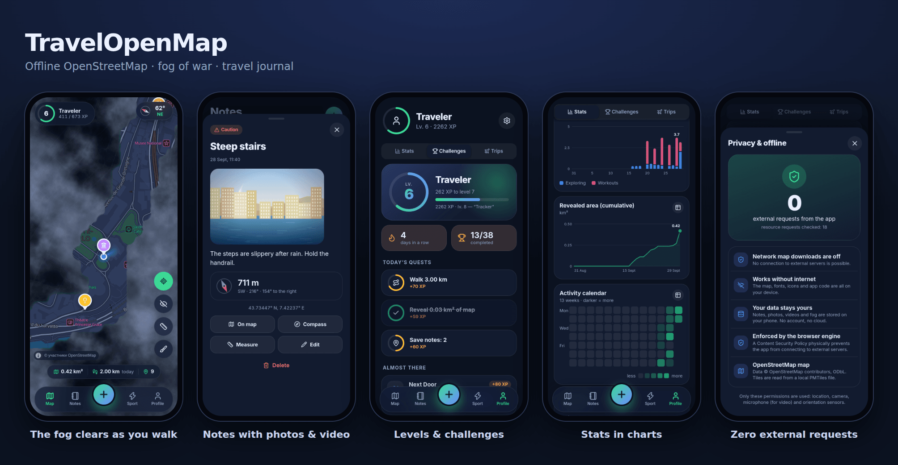

The world starts hidden in fog — it clears where you have been. Save places with photos, videos and notes, earn levels, complete challenges, train, and plan trips.

## ✨ Features

| | |
|---|---|
| 🌫️ **Fog of war** | Clears by GPS, reveal radius 30–150 m, soft glowing edges. |
| 💨 **Wind** | Fog clouds drift and gust; speed is adjustable or off. |
| ✏️ **Fog editor** | Reveal or cover a circle or a freehand area manually — for places you visited before installing the app. Undo the last edit. |
| 👁️ **Peek mode** | One toggle; your walked route is drawn over the map. |
| 📍 **Pins anywhere** | Long-press (or right-click) the map → menu: add a pin, reveal/cover fog, measure from here. Photos, videos, description, 9 categories. |
| 🔢 **Pin clusters** | Zoomed out, nearby pins merge into a bubble with a count and a category ring; tap to zoom in. Pins sharing one spot open as a list. |
| 📏 **Distance measuring** | Points on the map or on notes, leg and total length. Metric / imperial. |
| 🧭 **Compass** | Orientation sensors, arrow to a chosen pin, map-follows-compass. |
| 🏆 **Levels & challenges** | 60 levels, 10 ranks, 38 challenges, 3 daily quests, day streaks. |
| 📊 **Statistics** | Daily charts, cumulative area, activity calendar, distributions by hour, weekday and category; 7/30/90 days or all time. |
| 🏃 **Workouts** | Walking and running without fog: time, distance, pace, splits, elevation, calories, route, covered area (strip, loop, hull), history, GPX. |
| ✈️ **Trip planner** | Country, cities, dates or an “idea”, statuses, packing checklist, budget by category, timeline, countdown. |
| 🌍 **Country maps** | Country catalogue, four detail levels, size estimate. Download is optional (see [Offline & privacy](#-offline--privacy)); your own `.pmtiles` import from a file. |
| 🛡️ **Excluded zones** | Inside a circle (home, work) fog does not clear and steps/route are not recorded. |
| 💾 **Your data** | On-device IndexedDB, single-file backup, GPX and GeoJSON export. |
| 👤 **Onboarding & profile** | First launch asks for a nickname (required), avatar, country, weight, language, theme, units. All editable in Settings. |
| 🌗 **Theme** | System (follows the phone), light or dark — cards with previews in Settings. Russian and English, metric / imperial. |
| 📵 **No Google Play needed** | No Google services; location falls back to the system GPS. |

## 📸 Screenshots

<table>
<tr>
<td>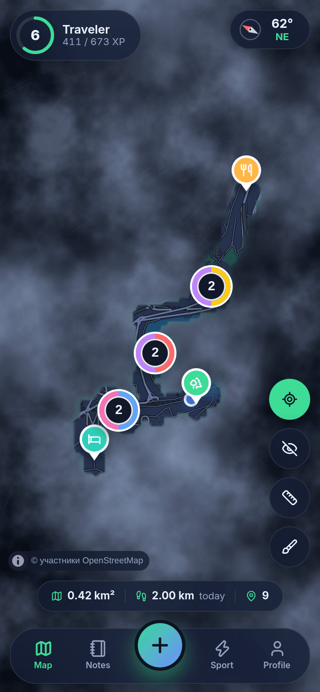<br><sub>Pin clusters with counts</sub></td>
<td>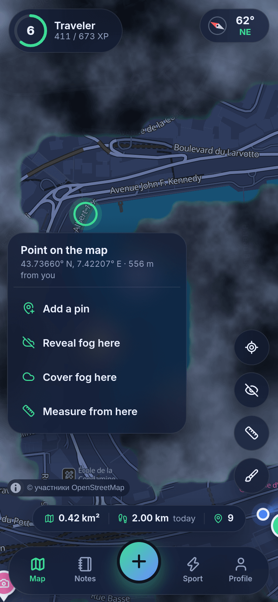<br><sub>Long-press menu</sub></td>
<td>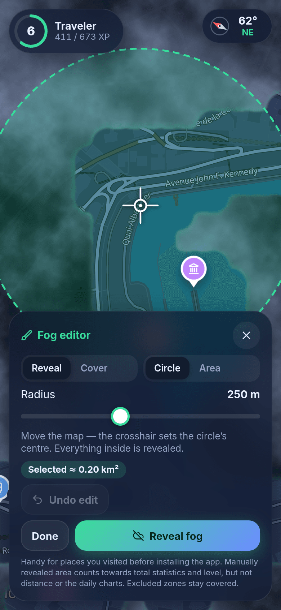<br><sub>Fog editor: circle</sub></td>
<td>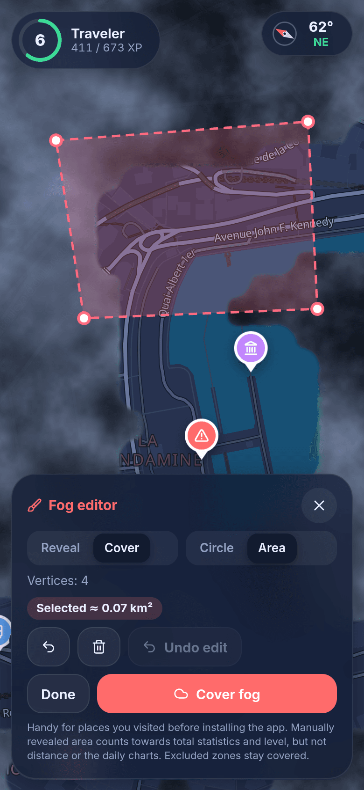<br><sub>Fog editor: area</sub></td>
</tr>
<tr>
<td>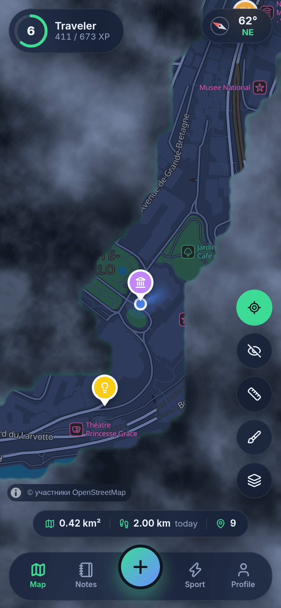<br><sub>Fog, pins, player</sub></td>
<td>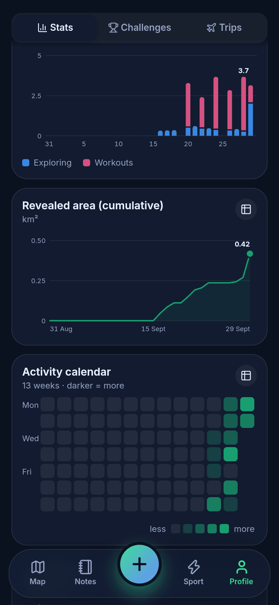<br><sub>Statistics</sub></td>
<td>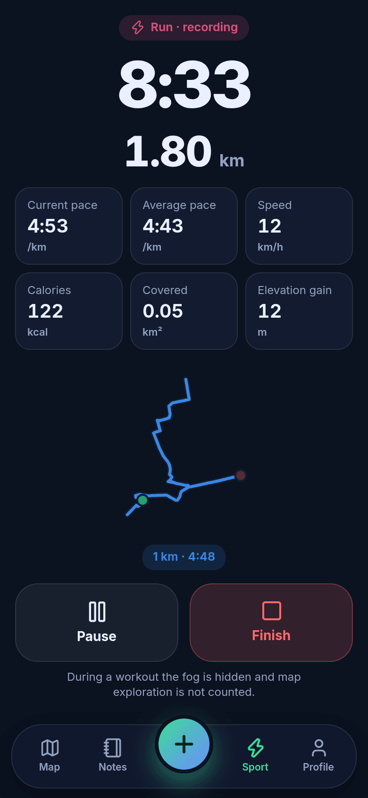<br><sub>Workout</sub></td>
<td>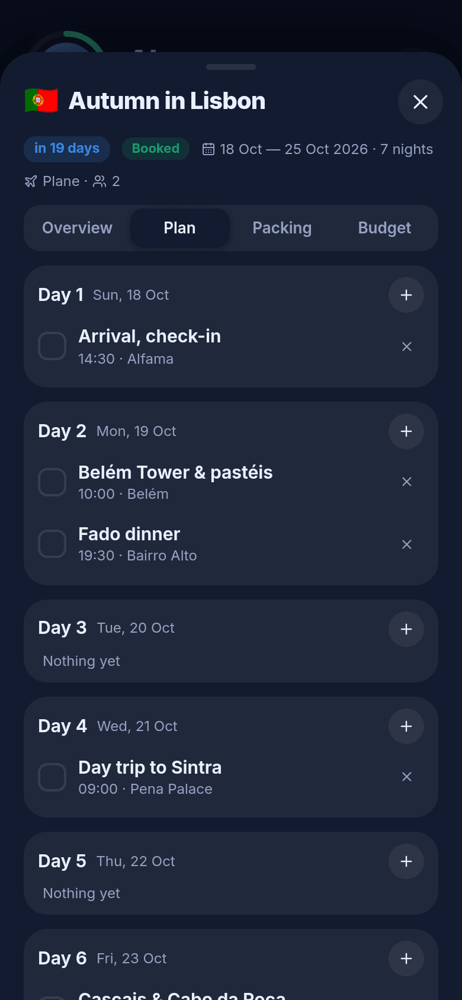<br><sub>Trip plan</sub></td>
</tr>
<tr>
<td>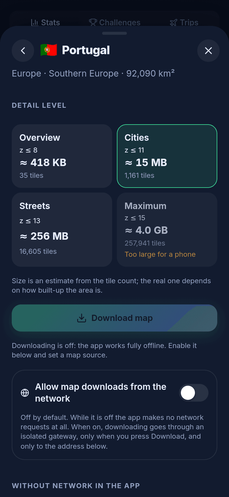<br><sub>Country map</sub></td>
<td>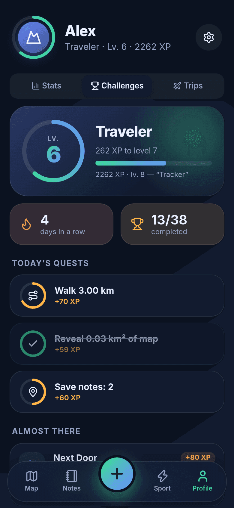<br><sub>Level and quests</sub></td>
<td>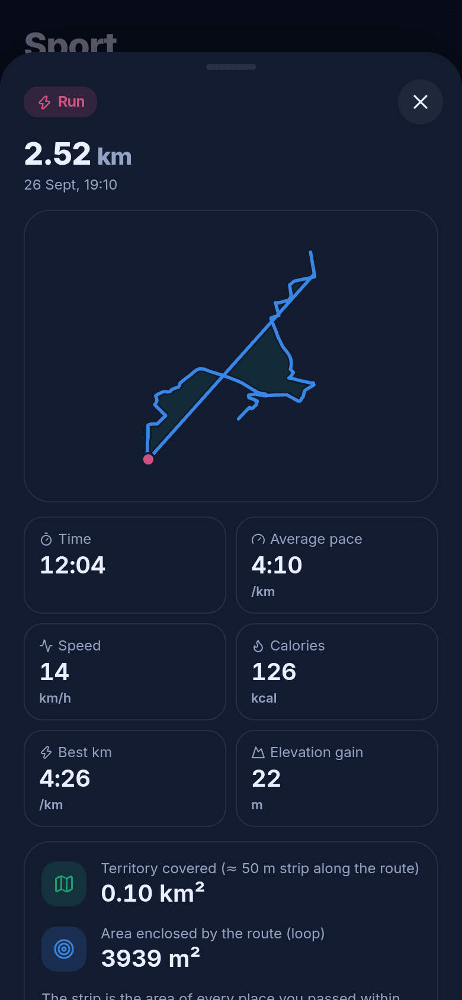<br><sub>Workout summary</sub></td>
<td>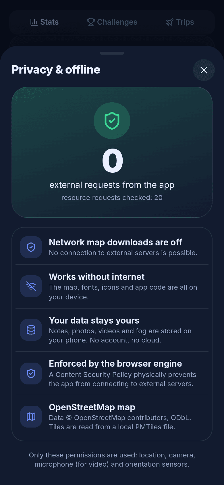<br><sub>0 external requests</sub></td>
</tr>
</table>

Overviews: [0.2](docs/screenshots/overview-en-2.png) · [0.3](docs/screenshots/overview-en-3.png) · [0.4](docs/screenshots/overview-en-4.png). Light theme and Russian UI — in [`docs/screenshots`](docs/screenshots).

## 🗺️ Offline maps

The map is OpenStreetMap vector tiles in a [PMTiles](https://docs.protomaps.com/pmtiles/) file ([Protomaps Basemaps](https://docs.protomaps.com/basemaps/layers) schema), read by MapLibre straight from the device. A Monaco map is bundled; everything else is added per region.

Ways to add a map ([details](docs/OFFLINE_MAPS.md)):

1. **In the app:** *Profile → Offline maps → Add country* (download) or *Import .pmtiles* (file).
2. **`pmtiles extract`** — cut an area from a Protomaps build.
3. **[`tools/osm2pmtiles.py`](tools/osm2pmtiles.py)** — local `.osm.pbf` → `.pmtiles` converter (tested on Monaco, Andorra, Utrecht).
4. **Planetiler** — countries and continents.

## 🔒 Offline & privacy

* The main app makes no network requests: CSP allows only `self`, `blob:`, `data:`; fonts, icons and map are local; no analytics or CDN.
* Country download is off by default. Enable *“Allow map downloads from the network”* and enter a PMTiles source URL; it runs through an isolated gateway ([`gateway.html`](gateway.html)) only while downloading.
* Android: the `INTERNET` permission is added by default. Build without it: `node scripts/configure-native.mjs --offline-only`.
* `npm run test:e2e` runs the production build in Chromium with DNS disabled for external hosts and checks that no request leaves the device.

*Profile → Privacy* shows the counters in-app.

## 🧱 Stack

Capacitor 8 · React 19 · TypeScript · Vite · MapLibre GL 6 · PMTiles · `@protomaps/basemaps` · supercluster · IndexedDB (`idb`) · Zustand · Vitest · Playwright. Architecture: [docs/ARCHITECTURE.md](docs/ARCHITECTURE.md).

## 🚀 Quick start

```bash
npm install
npm run dev          # http://localhost:5173 ; ?demo loads demo data (a route in Monaco)
npm test             # 93 unit tests
npm run test:e2e     # zero-request check
npm run build        # dist/
npm run release:test # test release: APK + AAB + web archive → release/
```

Android/iOS builds, signing, maps, troubleshooting: **[INSTALLATION.en.md](INSTALLATION.en.md)**.

## ⚠️ Limitations

* The Android release build (APK/AAB) is built in GitHub Actions ([`release-test.yml`](.github/workflows/release-test.yml)) and published as a pre-release ([v0.4.0-test.3](https://github.com/externaluser536-svg/TravelOpenMap/releases/tag/v0.4.0-test.3)); it is signed with a public test key — for testing only. The CI build passed; installing the APK on a device was not tested.
* Verified in Chromium (unit tests, e2e, screenshots). Native Android/iOS builds, real GPS/compass sensors, phone camera, and iOS WKWebView behaviour were not tested on devices.
* Country download was tested against a local PMTiles server; the real Protomaps server was not. The source must support HTTP Range and CORS.
* Fog and workouts are recorded while the app is on screen; no background GPS.
* Download size is an estimate; one download is capped at 300 MB.
* One active map file at a time.
* Map fonts: Latin, Cyrillic, Greek.

## 📄 Licenses

Code — MIT. Map data © OpenStreetMap contributors ([ODbL](https://www.openstreetmap.org/copyright)). Noto Sans — SIL OFL 1.1; sprites — [protomaps/basemaps-assets](https://github.com/protomaps/basemaps-assets). Monaco demo map — from Project-OSRM test data.
