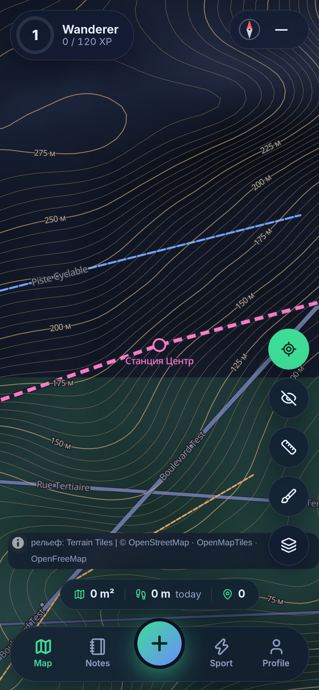
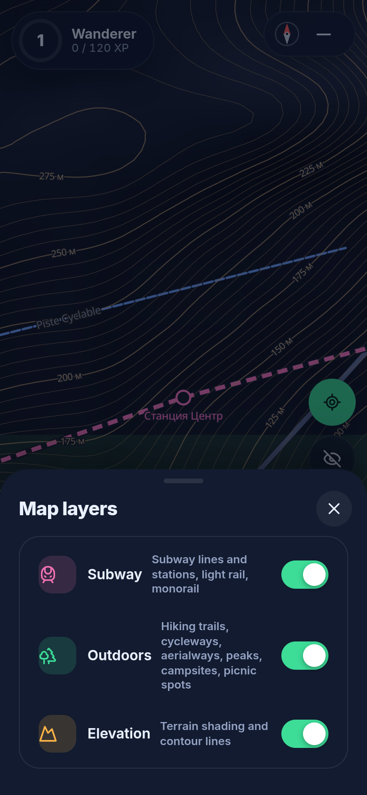
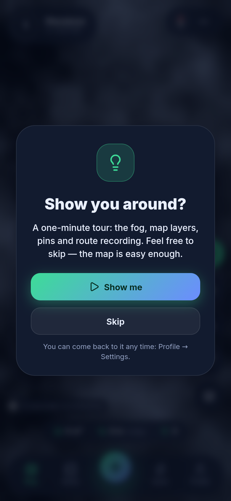
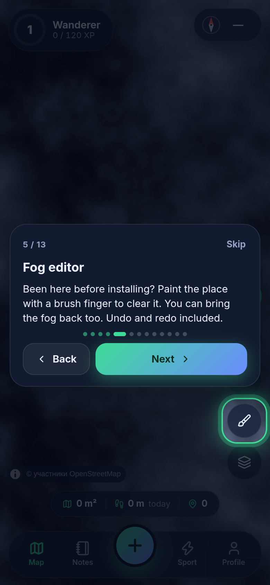
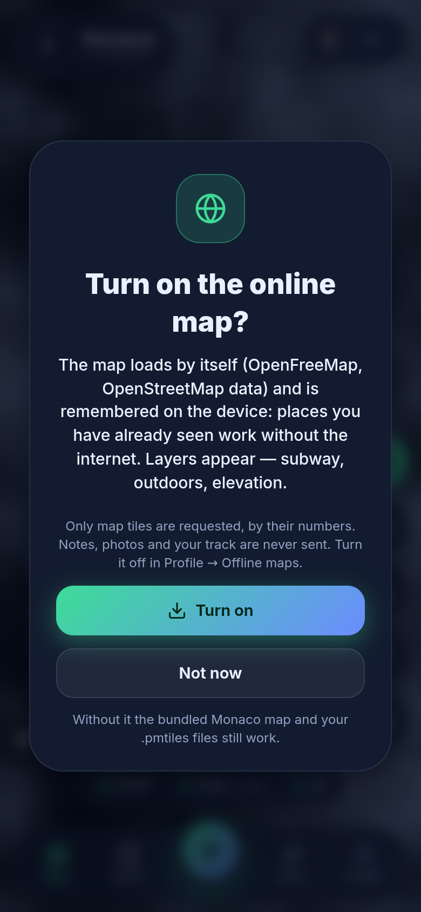
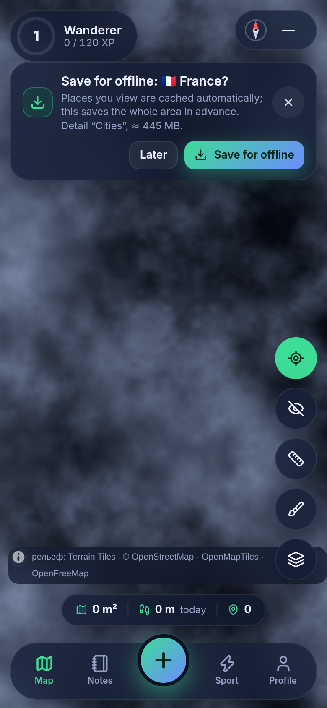
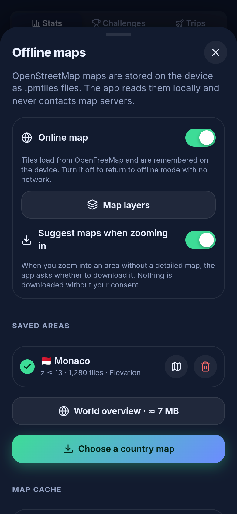

# 🧭 TravelOpenMap

**A cross-platform (Android · iOS · web) travel journal with a “fog of war” over an OpenStreetMap map. Works offline.**

*[Русская версия → README.md](README.md)*


The world starts hidden in fog — it clears where you have been. Save places with photos, videos and notes, earn levels, complete challenges, train, and plan trips.

## ✨ Features

| | |
|---|---|
| 🌫️ **Fog of war** | Clears by GPS, reveal radius 30–150 m, soft glowing edges. |
| 💨 **Wind** | Fog clouds drift and gust; speed is adjustable or off. |
| ✏️ **Fog editor** | Brush: drag a finger and the fog under your stroke clears or returns at once. Circle and freehand area tools too; pick a brush size, use two fingers to pan and zoom. Multi-step undo and redo. For places you visited before installing the app. |
| 👁️ **Peek mode** | One toggle; your walked route is drawn over the map. |
| 📍 **Pins anywhere** | Long-press (or right-click) the map → menu: add a pin, reveal/cover fog, measure from here. Photos, videos, description, 9 categories. |
| 🔢 **Pin clusters** | Zoomed out, nearby pins merge into a bubble with a count and a category ring; tap to zoom in. Pins sharing one spot open as a list. |
| 📏 **Distance measuring** | Points on the map or on notes, leg and total length. Metric / imperial. |
| 🧭 **Compass** | Orientation sensors, arrow to a chosen pin, map-follows-compass. |
| 🏆 **Levels & challenges** | 60 levels, 10 ranks, 38 challenges, 3 daily quests, day streaks. |
| 📊 **Statistics** | Daily charts, cumulative area, activity calendar, distributions by hour, weekday and category; 7/30/90 days or all time. |
| 🏃 **Workouts** | Walking and running without fog: time, distance, pace, splits, elevation, calories, route, covered area (strip, loop, hull), history, GPX. |
| ✈️ **Trip planner** | Country, cities, dates or an “idea”, statuses, packing checklist, budget by category, timeline, countdown. |
| 🗺️ **Online map** | [OpenFreeMap](https://openfreemap.org) tiles load by themselves as you browse and are cached on the device. Switched on only with your consent (see [Offline & privacy](#-offline--privacy)). |
| 🚇 **Map layers** | Subway, Outdoors (trails, cycle routes, peaks, campsites), Elevation (labelled contour lines and relief shading). |
| 📥 **Maps for offline** | Save a country or an area with a chosen detail level and a size estimate; zooming into an unfamiliar area offers to save it. Your own `.pmtiles` import from a file. |
| 🛰️ **Background tracking** | Android: a notification-backed service records your route while the app is minimised, without Google Play services; the trail is redrawn in order when you return. |
| 🎓 **Tutorial** | After onboarding a short interface tour is offered; skip it and replay later from Settings. |
| 🛡️ **Excluded zones** | Inside a circle (home, work) fog does not clear and steps/route are not recorded. |
| 💾 **Your data** | On-device IndexedDB, single-file backup, GPX and GeoJSON export. |
| 👤 **Onboarding & profile** | First launch asks for a nickname (required), avatar, country, weight, language, theme, units. All editable in Settings. |
| 🌗 **Theme** | System (follows the phone), light or dark — cards with previews in Settings. Russian and English, metric / imperial. |
| 📵 **No Google Play needed** | No Google services; location falls back to the system GPS. |

## 📸 Screenshots

<table>
<tr>
<td><br><sub>Pin clusters with counts</sub></td>
<td><br><sub>Long-press menu</sub></td>
<td><br><sub>Fog brush</sub></td>
<td><br><sub>Fog editor: area</sub></td>
</tr>
<tr>
<td><br><sub>Fog, pins, player</sub></td>
<td><br><sub>Statistics</sub></td>
<td><br><sub>Workout</sub></td>
<td><br><sub>Trip plan</sub></td>
</tr>
<tr>
<td><br><sub>Country map</sub></td>
<td><br><sub>Level and quests</sub></td>
<td><br><sub>Workout summary</sub></td>
<td><br><sub>0 external requests</sub></td>
</tr>
<tr>
<td><br><sub>Online map with layers</sub></td>
<td><br><sub>Map layers</sub></td>
<td><br><sub>Tutorial offer</sub></td>
<td><br><sub>Tutorial hint</sub></td>
</tr>
<tr>
<td><br><sub>Online map consent</sub></td>
<td><br><sub>Save an area</sub></td>
<td><br><sub>Saved areas and cache</sub></td>
<td><br><sub>App icon</sub></td>
</tr>
</table>

Overviews: [0.2](docs/screenshots/overview-en-2.png) · [0.3](docs/screenshots/overview-en-3.png) · [0.4](docs/screenshots/overview-en-4.png) · [0.5](docs/screenshots/overview-en-5.png) · [0.6](docs/screenshots/overview-en-6.png) · [0.6, online mode](docs/screenshots/overview-en-6b.png). Light theme and Russian UI — in [`docs/screenshots`](docs/screenshots).

## 🗺️ Maps

* **Online map.** OpenStreetMap vector tiles from [OpenFreeMap](https://openfreemap.org) (OpenMapTiles schema); MapLibre requests them as you browse and every tile is cached on the device (up to 500 MB, adjustable).
* **Layers.** Subway, Outdoors and Elevation are switched on with the layers button on the map. Relief comes from [AWS Terrain Tiles](https://registry.opendata.aws/terrain-tiles/); contours and shading are built on the device.
* **For offline.** *Profile → Offline maps → Pick a country* → detail level → “Save for offline”; the area's tiles are pinned in the cache. Without a connection the map is drawn from the cache.
* **Bundled and custom maps.** A Monaco map in [PMTiles](https://docs.protomaps.com/pmtiles/) format ships with the app; import your own `.pmtiles` from a file ([details](docs/OFFLINE_MAPS.md)).
* Sources and what is taken from each — [docs/MAP_SOURCES.md](docs/MAP_SOURCES.md) (Russian).

## 🔒 Offline & privacy

* Until you allow the online map the app makes no network requests: CSP allows `self`, `blob:`, `data:` and two map hosts — `tiles.openfreemap.org` and `elevation-tiles-prod.s3.amazonaws.com`; fonts, icons and the bundled map are local; no analytics.
* The online map is switched on in the consent dialog after onboarding or in *Profile → Offline maps*. The servers receive tile numbers (the approximate place you are viewing) and ordinary HTTP headers; notes, route and fog stay on the device.
* Background tracking stays off until you switch it on; track data never leaves the device.
* Android: the `INTERNET` permission is added by default. Build without it: `node scripts/configure-native.mjs --offline-only`.
* `npm run test:e2e` checks the production build in Chromium: without consent no request leaves the device, after consent only the two map hosts are contacted.

*Profile → Privacy* shows the counters in-app.

## 🧱 Stack

Capacitor 8 · React 19 · TypeScript · Vite · MapLibre GL 6 · OpenFreeMap (OpenMapTiles) · maplibre-contour · PMTiles · `@protomaps/basemaps` · supercluster · IndexedDB (`idb`) · Zustand · Vitest · Playwright. Architecture: [docs/ARCHITECTURE.md](docs/ARCHITECTURE.md).

## 🚀 Quick start

```bash
npm install
npm run dev          # http://localhost:5173 ; ?demo loads demo data (a route in Monaco)
npm test             # unit tests
npm run test:e2e     # zero-request check, fog brush, tutorial, online mode on mocked servers
npm run build        # dist/
npm run release:test # test release: APK + AAB + web archive → release/
```

Android/iOS builds, signing, maps, troubleshooting: **[INSTALLATION.en.md](INSTALLATION.en.md)**.

## ⚠️ Limitations

* The Android release build (APK/AAB) is built in GitHub Actions ([`release-test.yml`](.github/workflows/release-test.yml)) and published as a pre-release; it is signed with a public test key — for testing only. The CI build, including the background tracking service, passes; installing the APK on a device was not tested.
* Verified in Chromium (unit tests, e2e, screenshots). Native builds on devices, real GPS/compass sensors, phone camera, the background service on a real phone and iOS WKWebView behaviour were not tested.
* Online mode was tested against mocked servers (a tiny OpenMapTiles tile set plus real relief tiles when reachable). The real OpenFreeMap is unreachable from the development environment: response format, CORS, rate limits and layer data coverage were not verified.
* Background tracking is Android only; on iOS and the web fog and workouts are recorded while the app is on screen.
* An offline area is capped at 80,000 tiles, zoom up to 14 (relief up to 12); size is an estimate.
* Map fonts: Latin, Cyrillic, Greek.

## 📄 Licenses

Code — MIT. Map data © OpenStreetMap contributors ([ODbL](https://www.openstreetmap.org/copyright)); tiles — [OpenFreeMap](https://openfreemap.org) and © [OpenMapTiles](https://openmaptiles.org); relief — [Terrain Tiles](https://github.com/tilezen/joerd/blob/master/docs/attribution.md). Noto Sans — SIL OFL 1.1; sprites — [protomaps/basemaps-assets](https://github.com/protomaps/basemaps-assets). Monaco demo map — from Project-OSRM test data.
