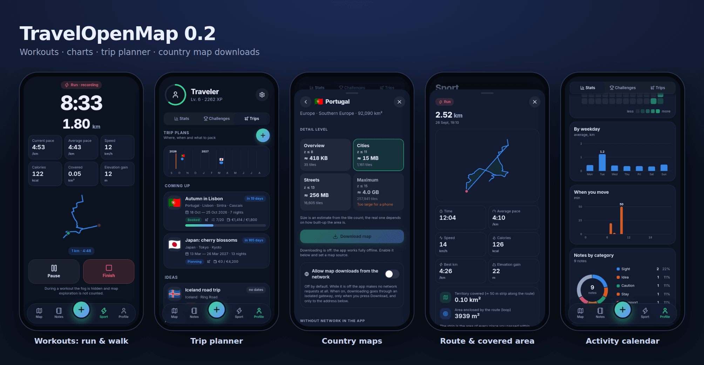
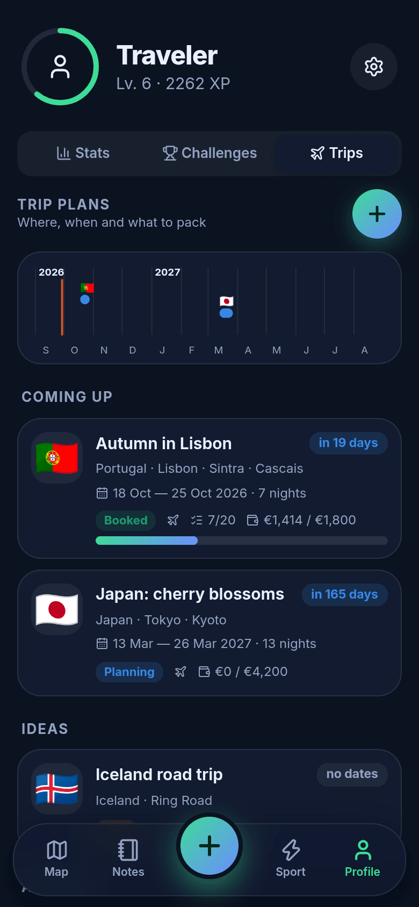
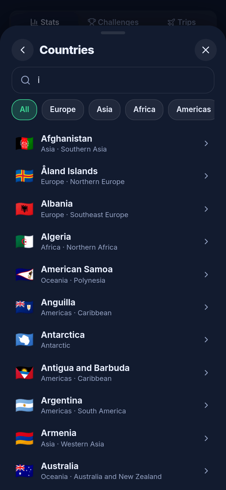
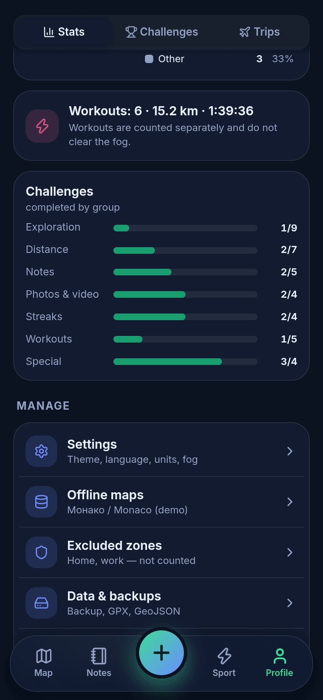

# 🧭 TravelOpenMap

**A cross-platform (Android · iOS · web) travel journal with a “fog of war” over an OpenStreetMap map — fully offline.**

*[Русская версия → README.md](README.md)*




The whole world starts hidden in fog. As you move, the fog clears where you have been. Along the way, save places with photos, videos and notes, earn XP and levels, and complete challenges. The map, fonts, icons and app code all live on the device: **by default the app makes zero external network requests** — verified, not just promised (see [Offline & privacy](#-offline--privacy)); the only exception is the optional, off-by-default country-map download.

## ✨ Features

* 🌫️ **Fog of war** — clears as you walk (GPS); reveal radius 30–150 m; soft glowing edges; animated reveal.
* 💨 **Windy fog** *(0.2)* — clouds drift with the wind, direction wanders, speed changes in gusts; adjustable or off; paused while the app is inactive.
* 👁️ **Peek mode** — one tap hides the fog and shows your walked route.
* 📍 **Map notes** — photos, videos, description, 9 categories, at your position or any point on the map; search, filters, sort by distance.
* 📏 **Distance measuring** — tap the map or notes; total length, last leg, labels along the line; metric/imperial.
* 🧭 **Compass** — sensor-driven dial, arrow to a chosen note with distance, “map follows compass” mode.
* 🏆 **Levels & challenges** — 60 levels, 10 ranks, 38 challenges (area, distance, notes, media, day streaks, training, special), 3 daily quests.
* 📊 **Statistics in charts** *(0.2)* — *Profile → Statistics*: daily bars, cumulative area, activity calendar, distributions (hours, weekdays, note categories), exploring-vs-training donut; 7/30/90 days or all time; tooltips and a table view for every chart.
* 🏃 **Workouts** *(0.2)* — a “Sport” tab: **walking and running** with no fog. Time, distance, pace/speed, per-km splits, best km, elevation gain, calories (MET × your weight), route and **area**: covered strip along the route, loop area, convex hull. History, details, GPX export, GPS-glitch protection.
* ✈️ **Trip planner** *(0.2)* — *Profile → Trips*: country, cities, dates (or an undated “idea”), status (idea → planned → booked → done / cancelled), packing checklist, budget by category, timeline and countdown.
* 🌍 **Country picker for downloads** *(0.2)* — *Profile → Offline maps → Add country*: searchable catalogue, four detail levels, size estimate **before** downloading. The download itself is optional and off by default; maps can also be added offline by importing a `.pmtiles` file tagged with a country.
* 🛡️ **Excluded zones** — draw a circle (home, work…): no fog clearing, no stats, no route recording inside.
* 🗺️ **Offline maps** — OSM vector tiles in a single `.pmtiles` file; bundled demo + import your own in-app.
* 💾 **Your data stays yours** — on-device IndexedDB, single-file backup, GPX/GeoJSON export. No accounts, no cloud.
* 🌗 Dark/light themes · 🇷🇺/🇬🇧 UI · metric/imperial units.

## 📸 Screenshots

<table>
<tr>
<td><br><sub>Fog clearing along your route</sub></td>
<td><br><sub>Note with photo</sub></td>
<td><br><sub>Level, streak, daily quests</sub></td>
<td><br><sub>0 external requests</sub></td>
</tr>
</table>

<table>
<tr>
<td><br><sub>Statistics in charts</sub></td>
<td><br><sub>Workout in progress</sub></td>
<td><br><sub>Workout summary: route, splits, area</sub></td>
<td><br><sub>Trip planner</sub></td>
</tr>
<tr>
<td><br><sub>Trips & timeline</sub></td>
<td><br><sub>Country picker</sub></td>
<td><br><sub>Detail level & size estimate</sub></td>
<td><br><sub>Distributions</sub></td>
</tr>
</table>

More (Russian UI, incl. light theme and the wind frames): [`docs/screenshots/ru-dark`](docs/screenshots) — peek mode, editor, compass, measuring, zones, maps, light theme.

## 🗺️ OpenStreetMap without the internet

**Yes — per region.** The full planet won't fit on a phone (~75 GB PBF, >100 GB of vector tiles), so the app uses a **region extract** as a [PMTiles](https://docs.protomaps.com/pmtiles/) file read directly from disk by MapLibre. Tile schema: [Protomaps Basemaps](https://docs.protomaps.com/basemaps/layers) with the official `@protomaps/basemaps` style. A Monaco demo map (0.8 MB) is bundled; import your own at *Profile → Offline maps*.

Ways to get a region ([details](docs/OFFLINE_MAPS.md)): `pmtiles extract` from a Protomaps build; [`tools/osm2pmtiles.py`](tools/osm2pmtiles.py) — our local `.osm.pbf` → `.pmtiles` converter (verified on Monaco, Andorra, Utrecht); Planetiler for countries.

> ⚠️ Honest note: in the environment where this was developed OSM/Protomaps servers were unreachable, so the demo map was built from a real OSM extract of Monaco taken from Project-OSRM's open test data. `pmtiles extract` and Planetiler are documented but were **not run** there; the converter and in-app import were fully tested.

## 🔒 Offline & privacy

1. **CSP** in `index.html` allows connections to `self`, `blob:`, `data:` only.
2. **No external resources** — UI fonts from npm, map fonts/sprites local, no analytics/CDN.
3. **Country download is the only exception and is off by default.** Until you enable *“Allow map downloads from the network”* and enter a source URL the app makes no request and “Download” is disabled. When you press it, the app creates a hidden **isolated gateway** for the duration of the download (`gateway.html`: a separate page with its own CSP, no access to your data — it receives only a URL and a bounding box). It reads the needed byte ranges (HTTP Range) from a PMTiles source, `src/map/extract.ts` assembles the country file, then the gateway is destroyed. The main app still cannot open external connections. *Privacy* shows how many times the gateway opened and to which hosts.
4. **Android:** `INTERNET` is now present **by default** (the gateway needs it). For a strict OS-level guarantee build with `node scripts/configure-native.mjs --offline-only` (country download unavailable; add maps by file).
5. **`npm run test:e2e`** runs the *production build* in Chromium with DNS disabled for all external hosts, walks a street via emulated GPS, creates a note with a photo and records **every** request: all 25 requests went to the local origin; `fetch`/``/`WebSocket` probes to external hosts were blocked by CSP; by default there is no gateway iframe and “Download” is disabled. The download itself was tested separately against a local PMTiles server (Monaco as the “source”): 0 external requests from the main app, 32 Range requests from the gateway, output is a valid `.pmtiles`.

The *Profile → Privacy* screen shows the same live counter inside the app.

## 🧱 Stack

Capacitor 8 · React 19 · TypeScript · Vite · MapLibre GL 6 + PMTiles + `@protomaps/basemaps` · IndexedDB (`idb`) · Zustand · Vitest (67 tests) · Playwright.
Fog = grid of Web Mercator z20 cells (~27 m at Monaco) + Canvas renderer (low-res mask, brushes, threshold curve, edge glow); 2–8 ms/frame with 341k cells (261 km²). See [docs/ARCHITECTURE.md](docs/ARCHITECTURE.md).

## 🚀 Quick start

```bash
npm install
npm run dev          # http://localhost:5173  (add ?demo to load demo data)
npm test && npm run test:e2e      # 67 unit tests + zero-request check
npm run build
```

Android/iOS builds, signing, maps, troubleshooting: **[INSTALLATION.en.md](INSTALLATION.en.md)**.

## ⚠️ Verified vs. not verified

Verified here: unit tests (67), types, production build, the full user path in Chromium (GPS emulation, notes with photos, measuring, zones, `.pmtiles` import, themes, ru/en), zero external requests (and that the download gateway is inactive by default), a country download from a local PMTiles server, fog performance, all new screens (screenshots).
**Not verified** (no Android SDK/Xcode/devices): native builds, real GPS/compass sensors, phone camera video capture, iOS WKWebView behaviour.
**Not verified for 0.2:** downloading from the real Protomaps server (unreachable in the dev environment) — the source must support HTTP Range and CORS (`Access-Control-Allow-Origin`, `Access-Control-Expose-Headers: Content-Range`), otherwise the gateway reports an error and you can import a file instead. Download size is an **estimate** (tile count is exact, bytes are heuristic) and capped at 300 MB in memory. Calories are a MET-based estimate; area accuracy depends on GPS accuracy.
Known limits: no background GPS tracking — fog and workouts are recorded only while the app is on screen (planned); one active map at a time; converter emits a subset of the Protomaps schema; map fonts cover Latin/Cyrillic/Greek only.

## 📄 Licenses

Code — MIT. Map data © OpenStreetMap contributors ([ODbL](https://www.openstreetmap.org/copyright)). Noto Sans — SIL OFL 1.1; sprites — [protomaps/basemaps-assets](https://github.com/protomaps/basemaps-assets).
