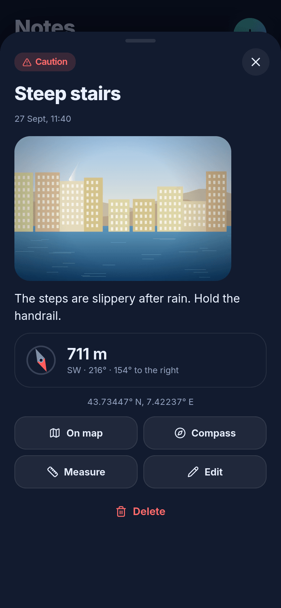

# 🧭 TravelOpenMap

**A cross-platform (Android · iOS · web) travel journal with a “fog of war” over an OpenStreetMap map — fully offline.**

*[Русская версия → README.md](README.md)*


The whole world starts hidden in fog. As you move, the fog clears where you have been. Along the way, save places with photos, videos and notes, earn XP and levels, and complete challenges. The map, fonts, icons and app code all live on the device: **the app makes zero external network requests** — and that is verified, not just promised (see [Offline & privacy](#-offline--privacy)).

## ✨ Features

* 🌫️ **Fog of war** — clears as you walk (GPS); reveal radius 30–150 m; soft glowing edges; animated reveal.
* 👁️ **Peek mode** — one tap hides the fog and shows your walked route.
* 📍 **Map notes** — photos, videos, description, 9 categories, at your position or any point on the map; search, filters, sort by distance.
* 📏 **Distance measuring** — tap the map or notes; total length, last leg, labels along the line; metric/imperial.
* 🧭 **Compass** — sensor-driven dial, arrow to a chosen note with distance, “map follows compass” mode.
* 🏆 **Levels & challenges** — 60 levels, 10 ranks, 33 challenges (area, distance, notes, media, day streaks, special), 3 daily quests.
* 🛡️ **Excluded zones** — draw a circle (home, work…): no fog clearing, no stats, no route recording inside.
* 🗺️ **Offline maps** — OSM vector tiles in a single `.pmtiles` file; bundled demo + import your own in-app.
* 💾 **Your data stays yours** — on-device IndexedDB, single-file backup, GPX/GeoJSON export. No accounts, no cloud.
* 🌗 Dark/light themes · 🇷🇺/🇬🇧 UI · metric/imperial units.

## 📸 Screenshots

<table>
<tr>
<td><br><sub>Fog clearing along your route</sub></td>
<td><br><sub>Note with photo</sub></td>
<td><br><sub>Level, streak, daily quests</sub></td>
<td><br><sub>0 external requests</sub></td>
</tr>
</table>

More (Russian UI): [`docs/screenshots/ru-dark`](docs/screenshots) — peek mode, editor, compass, measuring, zones, maps, light theme.

## 🗺️ OpenStreetMap without the internet

**Yes — per region.** The full planet won't fit on a phone (~75 GB PBF, >100 GB of vector tiles), so the app uses a **region extract** as a [PMTiles](https://docs.protomaps.com/pmtiles/) file read directly from disk by MapLibre. Tile schema: [Protomaps Basemaps](https://docs.protomaps.com/basemaps/layers) with the official `@protomaps/basemaps` style. A Monaco demo map (0.8 MB) is bundled; import your own at *Profile → Offline maps*.

Ways to get a region ([details](docs/OFFLINE_MAPS.md)): `pmtiles extract` from a Protomaps build; [`tools/osm2pmtiles.py`](tools/osm2pmtiles.py) — our local `.osm.pbf` → `.pmtiles` converter (verified on Monaco, Andorra, Utrecht); Planetiler for countries.

> ⚠️ Honest note: in the environment where this was developed OSM/Protomaps servers were unreachable, so the demo map was built from a real OSM extract of Monaco taken from Project-OSRM's open test data. `pmtiles extract` and Planetiler are documented but were **not run** there; the converter and in-app import were fully tested.

## 🔒 Offline & privacy

1. **CSP** in `index.html` allows connections to `self`, `blob:`, `data:` only.
2. **No `INTERNET` permission on Android** (`scripts/configure-native.mjs`).
3. **No external resources** — UI fonts from npm, map fonts/sprites local, no analytics/CDN.
4. **`npm run test:e2e`** runs the *production build* in Chromium with DNS disabled for all external hosts, walks a street via emulated GPS, creates a note with a photo and records **every** request: all 20 requests were to the local origin; `fetch`/``/`WebSocket` probes to external hosts were blocked by CSP.

The *Profile → Privacy* screen shows the same live counter inside the app.

## 🧱 Stack

Capacitor 8 · React 19 · TypeScript · Vite · MapLibre GL 6 + PMTiles + `@protomaps/basemaps` · IndexedDB (`idb`) · Zustand · Vitest (40 tests) · Playwright.
Fog = grid of Web Mercator z20 cells (~27 m at Monaco) + Canvas renderer (low-res mask, brushes, threshold curve, edge glow); 2–8 ms/frame with 341k cells (261 km²). See [docs/ARCHITECTURE.md](docs/ARCHITECTURE.md).

## 🚀 Quick start

```bash
npm install
npm run dev          # http://localhost:5173  (add ?demo to load demo data)
npm test && npm run test:e2e
npm run build
```

Android/iOS builds, signing, maps, troubleshooting: **[INSTALLATION.en.md](INSTALLATION.en.md)**.

## ⚠️ Verified vs. not verified

Verified here: unit tests, types, production build, the full user path in Chromium (GPS emulation, notes with photos, measuring, zones, `.pmtiles` import, themes, ru/en), zero external requests, fog performance.
**Not verified** (no Android SDK/Xcode/devices): native builds, real GPS/compass sensors, phone camera video capture, iOS WKWebView behaviour.
Known v0.1 limits: no background GPS tracking (planned); one active map at a time; converter emits a subset of the Protomaps schema; map fonts cover Latin/Cyrillic/Greek only.

## 📄 Licenses

Code — MIT. Map data © OpenStreetMap contributors ([ODbL](https://www.openstreetmap.org/copyright)). Noto Sans — SIL OFL 1.1; sprites — [protomaps/basemaps-assets](https://github.com/protomaps/basemaps-assets).
