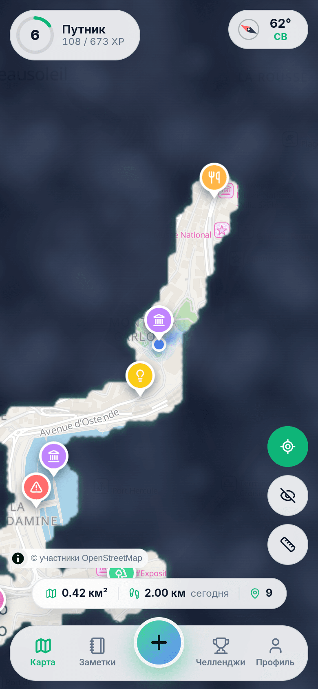
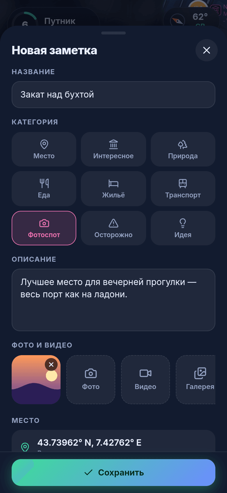
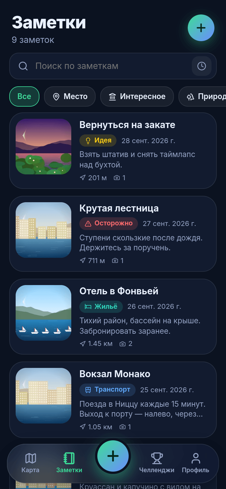
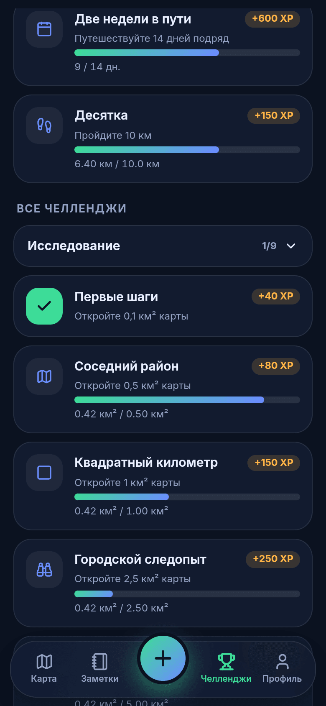
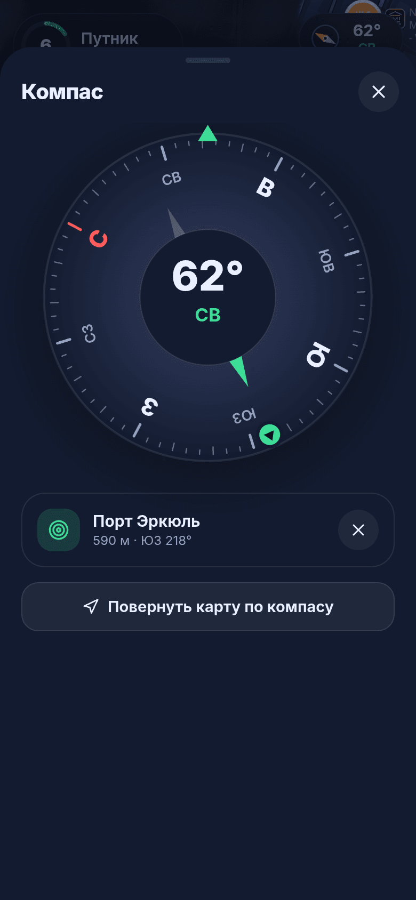
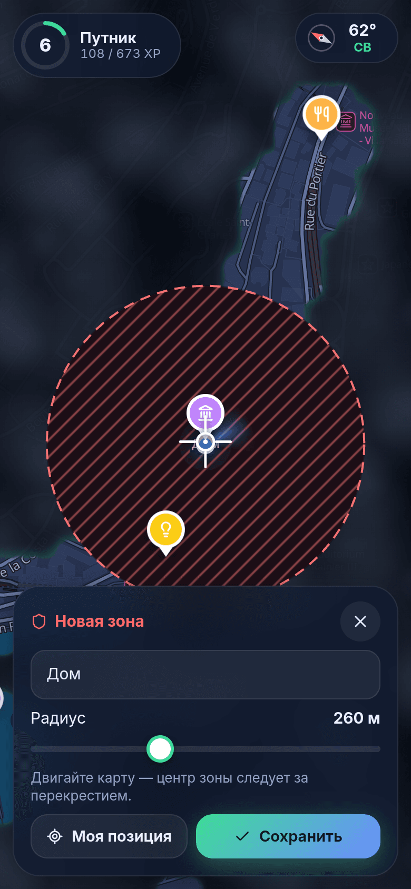
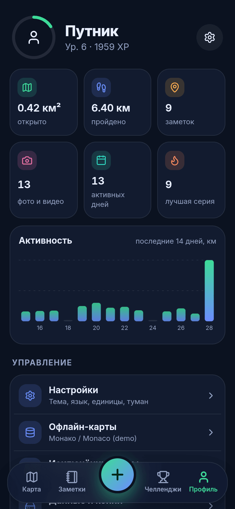
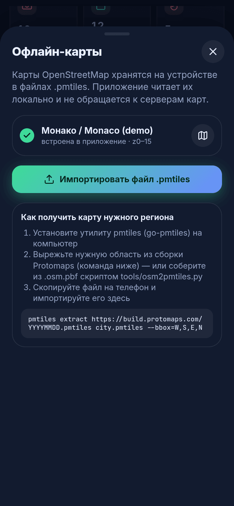
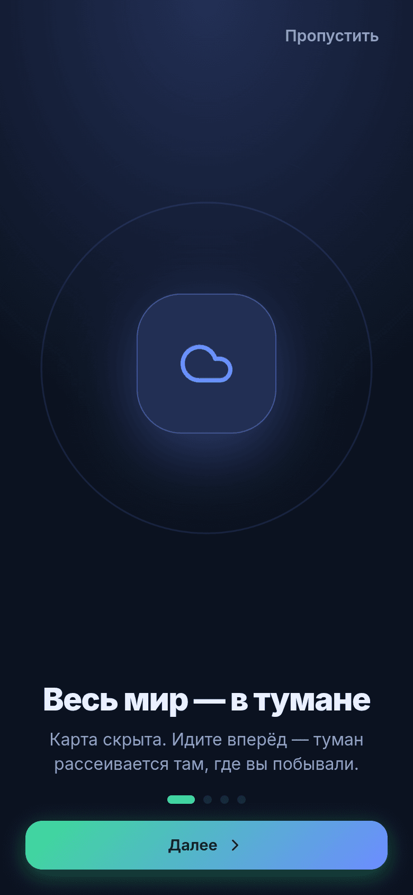

# 🧭 TravelOpenMap

**Кроссплатформенный (Android · iOS · веб) дневник путешествий с «туманом войны» на карте OpenStreetMap — целиком офлайн.**

*[English version → README.en.md](README.en.md)*


Весь мир скрыт туманом. Вы идёте — туман рассеивается там, где вы побывали. По пути сохраняйте места с фото, видео и описанием, получайте опыт и уровни, проходите челленджи. Карта, шрифты, иконки и код приложения лежат на устройстве: **приложение не отправляет ни одного внешнего запроса** (это не обещание, а проверяемый факт — см. [«Офлайн и приватность»](#-офлайн-и-приватность)).

---

## ✨ Возможности

| | |
|---|---|
| 🌫️ **Туман войны** | Карта закрыта туманом; он рассеивается по мере вашего движения по GPS. Радиус открытия настраивается (30–150 м), границы мягкие, с подсветкой. Открытие анимируется. |
| 👁️ **Карта без тумана** | Одна кнопка — и туман исчезает, а поверх карты показывается пройденный маршрут. |
| 📍 **Заметки на карте** | Фото, видео, описание, категория (9 штук), точка — ваше место или любое место на карте. Поиск, фильтры, сортировка по расстоянию. |
| 📏 **Измерение расстояний** | Ставьте точки на карте или на заметках — видно суммарную длину, длину последнего отрезка и подписи вдоль линии. Метры/мили. |
| 🧭 **Компас** | Циферблат на датчиках ориентации, стрелка на выбранную заметку с расстоянием, режим «карта следует за компасом». |
| 🏆 **Уровни и челленджи** | 60 уровней и 10 званий (от «Прохожего» до «Хранителя мира»), 33 челленджа (площадь, дистанция, заметки, медиа, серии дней, особые), 3 ежедневных задания, серии дней. |
| 🛡️ **Исключённые зоны** | Задайте круг (дом, работа, что угодно): там туман не рассеивается, шаги не считаются, маршрут не пишется. |
| 🗺️ **Офлайн-карты** | Векторные тайлы OSM в одном файле `.pmtiles`. Встроенная демо-карта + импорт своих файлов прямо из приложения. |
| 💾 **Ваши данные — у вас** | IndexedDB на устройстве, резервная копия одним файлом, экспорт в GPX и GeoJSON. Ни аккаунтов, ни облака. |
| 🌗 **Тёмная / светлая темы**, 🇷🇺/🇬🇧 интерфейс, метрические/имперские единицы. | |

## 📸 Скриншоты

Все скриншоты сняты с **настоящей сборки приложения**: демо-данные — это пеший маршрут по реальным улицам Монако (кратчайшие пути по OSM-графу между достопримечательностями), проигранный через тот же движок, что и живой GPS ([`scripts/screenshots.mjs`](scripts/screenshots.mjs)). Фото в заметках — сгенерированные картинки-заглушки.

<table>
<tr>
<td><br><sub>Главная: туман, заметки, игрок</sub></td>
<td><br><sub>Светлая тема, обзор пройденного</sub></td>
<td><br><sub>Карта без тумана + маршрут</sub></td>
<td><br><sub>Заметка с фото и компасом</sub></td>
</tr>
<tr>
<td><br><sub>Новая заметка: фото, видео, категория</sub></td>
<td><br><sub>Список заметок</sub></td>
<td><br><sub>Уровень, серия, задания дня</sub></td>
<td><br><sub>Челленджи</sub></td>
</tr>
<tr>
<td><br><sub>Компас с целью</sub></td>
<td><br><sub>Измерение расстояния</sub></td>
<td><br><sub>Исключённая зона</sub></td>
<td><br><sub>0 внешних запросов</sub></td>
</tr>
<tr>
<td><br><sub>Профиль и статистика</sub></td>
<td><br><sub>Офлайн-карты</sub></td>
<td><br><sub>Новый уровень</sub></td>
<td><br><sub>Первый запуск</sub></td>
</tr>
</table>

Светлая тема: [карта](docs/screenshots/ru-light/01-map.png) · [обзор](docs/screenshots/ru-light/02-fog-overview.png) · [без тумана](docs/screenshots/ru-light/03-peek.png) · [челленджи](docs/screenshots/ru-light/07-quests.png) · [профиль](docs/screenshots/ru-light/09-profile.png). English UI: [`docs/screenshots/en-dark`](docs/screenshots/en-dark).

---

## 🗺️ OpenStreetMap без интернета — как это устроено

Короткий ответ на вопрос «можно ли выгрузить OpenStreetMap, чтобы приложение никуда не ходило»: **да — по регионам**.

* Целая планета не влезет в телефон: `planet.osm.pbf` — порядка 75 ГБ, готовые векторные тайлы до z15 — больше 100 ГБ. Поэтому приложение работает с **выгрузкой нужного региона** (город, область, страна, маршрут поездки) в формате [PMTiles](https://docs.protomaps.com/pmtiles/) — один файл, из которого MapLibre читает тайлы напрямую с диска, без HTTP-сервера.
* Схема тайлов — [Protomaps Basemaps](https://docs.protomaps.com/basemaps/layers), стиль — официальный пакет `@protomaps/basemaps`. Поэтому подходят **готовые выгрузки Protomaps** (`pmtiles extract`) и любые тайлы той же схемы.
* Шрифты (Noto Sans) и спрайты иконок лежат в `public/map-assets/` (3 МБ) — их скачивает один раз `npm run assets:fonts`.
* Встроена демо-карта **Монако** (0,8 МБ, zoom 0–15). Свои карты добавляются в приложении: *Профиль → Офлайн-карты → Импортировать .pmtiles*.

Три способа получить карту региона (подробно — [docs/OFFLINE_MAPS.md](docs/OFFLINE_MAPS.md)):

1. **`pmtiles extract`** — вырезать bbox из сборки Protomaps (самый быстрый путь).
2. **[`tools/osm2pmtiles.py`](tools/osm2pmtiles.py)** — наш конвертер `.osm.pbf` → `.pmtiles`, для городов и небольших регионов; работает полностью локально. **Проверен на реальных данных:** Монако (0,8 МБ, 11 с), Андорра (горы, без моря; 0,8 МБ, 4 с), Утрехт (каналы, 11 МБ PBF → 4,6 МБ, 83 с). Все три открываются в приложении.
3. **Planetiler** — для стран и континентов.

> ⚠️ Честная оговорка: в среде, где я разрабатывал приложение, серверы OSM (Geofabrik, Overpass, Protomaps) были недоступны, поэтому демо-карта собрана из настоящей OSM-выгрузки Монако из открытого репозитория Project-OSRM. Пути 1 и 3 описаны по документации и **в этой среде не запускались**; путь 2 и импорт файлов проверены полностью.

## 🔒 Офлайн и приватность

Гарантия многоуровневая:

1. **Политика CSP** в [`index.html`](index.html) разрешает соединения только к `self`, `blob:`, `data:` — WebView физически не выпустит запрос наружу.
2. **Нет разрешения `INTERNET` на Android** ([`scripts/configure-native.mjs`](scripts/configure-native.mjs)) — ОС не даст открыть сокет.
3. **Нет внешних ресурсов**: шрифты интерфейса (Inter) — пакетом npm, шрифты и иконки карты — локально, аналитики и CDN нет.
4. **Автотест `npm run test:e2e`** запускает *продакшн-сборку* в Chromium с отключённым DNS для всех внешних хостов, «идёт» по улице через эмулированный GPS, создаёт заметку с фото и записывает **каждый** сетевой запрос. Результат на момент написания:

```
✅ GPS → туман открывается — 0.01 км² → 0.08 км²
✅ заметка с фото сохранена и видна в списке
✅ экран «Приватность» показывает 0 внешних запросов
✅ fetch /  / WebSocket на внешний сервер блокируются (CSP зафиксировал 3 нарушения)
✅ все запросы приложения — только на локальный origin (20 шт.)
✅ карта, шрифты и спрайты читаются из локальных файлов
```

Экран **Профиль → Приватность** показывает то же самое в самом приложении (счётчик внешних обращений по Resource Timing).

## 🎮 Уровни, XP и челленджи

XP считается из статистики (а не копится «руками»), поэтому всегда согласован с данными:

| Источник | XP |
|---|---|
| Открытая карта | 1 XP за каждые 1500 м² |
| Пройденный путь | 1 XP за каждые 50 м |
| Заметка / фото / видео | 25 / 5 / 10 |
| Челлендж / задание дня | 30 … 4000 / 45 … 90 |

Уровень *n* требует `120·(n−1)^1.7` XP (2-й — 120, 5-й — 1 267, 10-й — 5 028, 20-й — 17 909, 50-й — 89 643). Звания: Прохожий → Турист (3) → Путник (5) → Следопыт (8) → Исследователь (12) → Первопроходец (17) → Картограф (23) → Навигатор (30) → Легенда карт (40) → Хранитель мира (50).

Челленджи: **площадь** (0,1 → 100 км²), **дистанция** (1 → 1000 км), **заметки** (1 → 100), **фото/видео**, **серии дней** (3 → 30), **особые** («Ранняя пташка», «Ночная сова», «Разносторонний», «Марш-бросок 10 км/день»). Ежедневные задания детерминированно зависят от даты.

## 🧱 Технологии и устройство

| Слой | Технология |
|---|---|
| Оболочка | [Capacitor 8](https://capacitorjs.com) (Android, iOS) — один код для всех платформ, работает и как PWA |
| UI | React 19 + TypeScript + Vite, собственная дизайн-система (CSS-переменные, стекло, тёмная/светлая темы) |
| Карта | MapLibre GL JS 6 + PMTiles + стиль `@protomaps/basemaps` |
| Туман | Сетка ячеек Web Mercator z20 (≈27 м в Монако) + Canvas-рендерер: маска низкого разрешения, кисти, пороговая кривая, свечение границы |
| Данные | IndexedDB (`idb`): заметки, медиа, чанки тумана, дни, треки, карты |
| Состояние | Zustand |
| Датчики | Geolocation (Capacitor), DeviceOrientation (компас), Haptics |
| Тесты | Vitest (40 тестов), Playwright (e2e-проверка офлайна, скриншоты) |

Почему туман — это сетка ячеек, а не «полигон с дырками»: объединять сотни тысяч пересекающихся кругов в полигон дорого, а ячейки дают O(1) на проверку/добавление, простую сериализацию по чанкам 64×64 и точную статистику площади. На 340 тыс. ячеек (261 км² пройденного) отрисовка занимает 2–8 мс на кадр (замерено, headless Chromium с программным рендерингом).

```
src/
  core/      чистая логика без браузера: гео, туман (FogGrid), уровни, челленджи, дни, GPX  ← покрыто тестами
  state/     engine (GPS → туман → XP), prefs, store, actions
  map/       MapLibre, PMTiles, стиль, FogRenderer, каталог карт
  data/      IndexedDB, резервные копии
  services/  геолокация, компас, медиа, файлы, вибро
  ui/        экраны, шторки, компоненты
  i18n/      ru / en (тест следит, чтобы словари не расходились)
  dev/       демо-данные (только dev/demo-сборки)
tools/       osm2pmtiles.py, make-demo-route.py, fetch-map-assets.mjs, build-demo-map.sh
scripts/     screenshots, verify-offline, configure-native, make-icons
docs/        OFFLINE_MAPS.md, ARCHITECTURE.md, screenshots/
android/ ios/   нативные проекты Capacitor (настроены скриптом)
```

## 🚀 Быстрый старт

```bash
npm install
npm run dev          # http://localhost:5173 ; добавьте ?demo — загрузятся демо-данные (маршрут по Монако, заметки, история)
npm test             # 40 юнит-тестов
npm run test:e2e     # проверка «0 внешних запросов» на продакшн-сборке
npm run build        # веб-сборка в dist/
```

Сборка Android/iOS-приложений, подписание, импорт карт, решение проблем — в **[INSTALLATION.md](INSTALLATION.md)**.

## ⚠️ Что проверено, а что нет

Проверено автоматически в этой среде: юнит-тесты (40), типы, продакшн-сборка, весь пользовательский путь в Chromium (GPS-эмуляция, заметки с фото, измерение, зоны, импорт `.pmtiles`, тёмная/светлая темы, ru/en), отсутствие внешних запросов, производительность тумана.

**Не проверялось** (нет Android SDK / Xcode / устройств): сборка и запуск нативных приложений, реальные датчики компаса и GPS, запись видео с камеры телефона, поведение WebView с custom-схемой на iOS. Нативные проекты сгенерированы Capacitor и настроены скриптом, но на реальном устройстве их ещё предстоит проверить — см. раздел «Решение проблем» в INSTALLATION.md.

**Известные ограничения v0.1**

* Туман открывается, только пока приложение на экране (фоновое отслеживание GPS не реализовано — это следующий шаг, плагин `@capacitor-community/background-geolocation`).
* Один активный файл карты одновременно; для длинных поездок делайте карту-объединение нужных регионов.
* Метки на карте в PMTiles-выгрузке нашего конвертера — подмножество схемы Protomaps (нет `landcover`, `transit`, дорожных щитов); у выгрузок `pmtiles extract` этого ограничения нет.
* Шрифты карты включают латиницу, кириллицу, греческий; для CJK/арабского нужны дополнительные диапазоны глифов.
* Полная резервная копия с видео хранится как base64 внутри JSON — для очень больших коллекций она тяжёлая.

## 📄 Лицензии и атрибуция

Код — MIT. Данные карт — © участники OpenStreetMap, [ODbL](https://www.openstreetmap.org/copyright) (атрибуция показывается на карте). Шрифты Noto Sans — SIL OFL 1.1, спрайты — [protomaps/basemaps-assets](https://github.com/protomaps/basemaps-assets). Демо-выгрузка Монако — из тестовых данных Project-OSRM (данные OSM).
