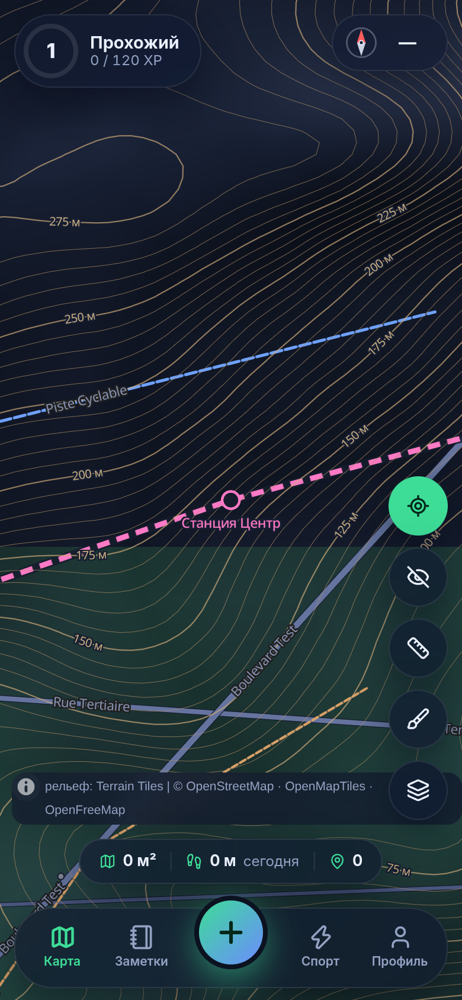
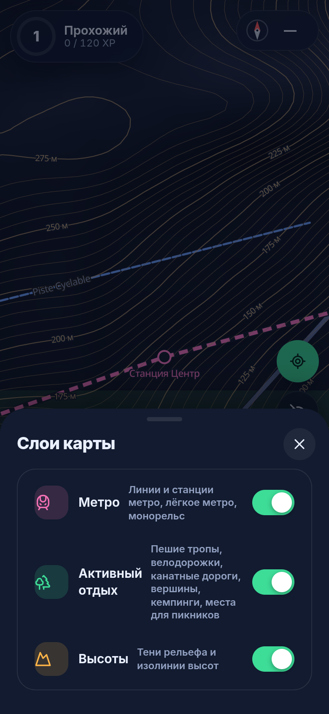
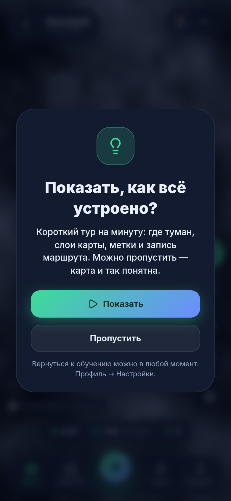
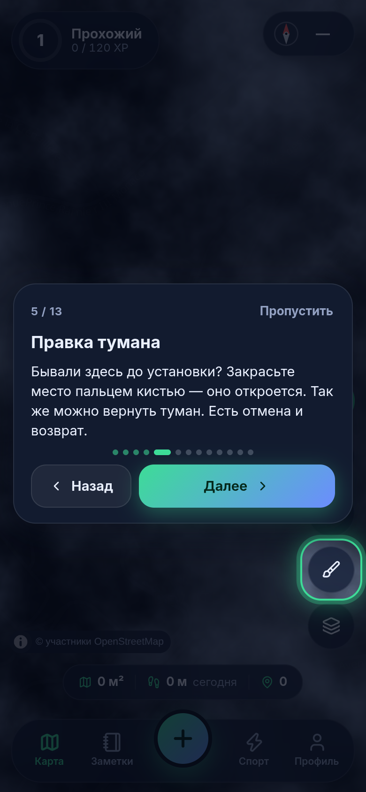
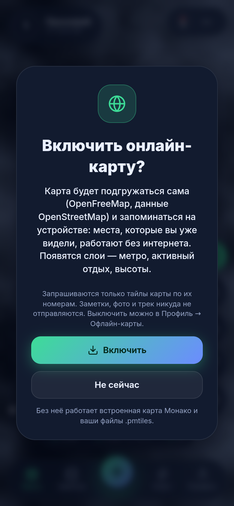
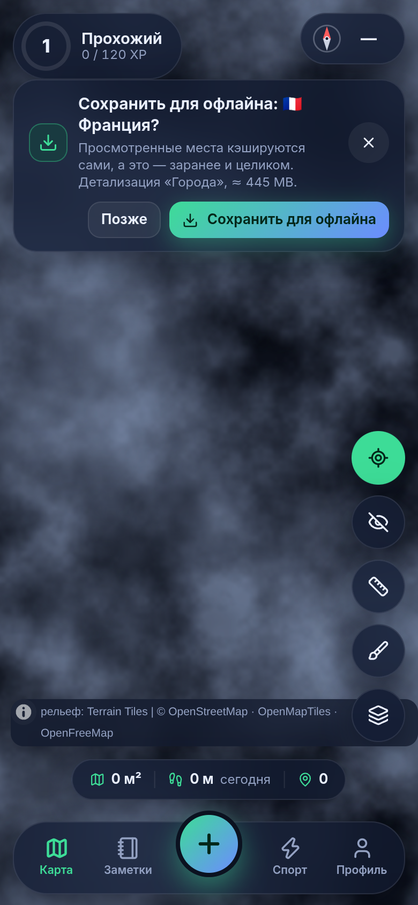
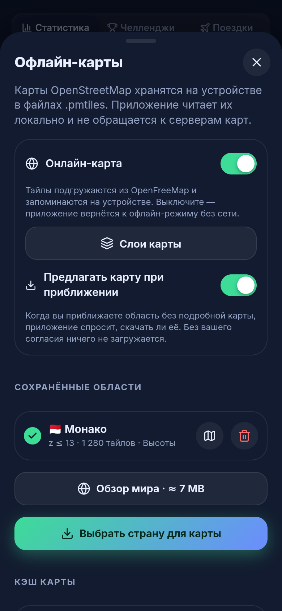
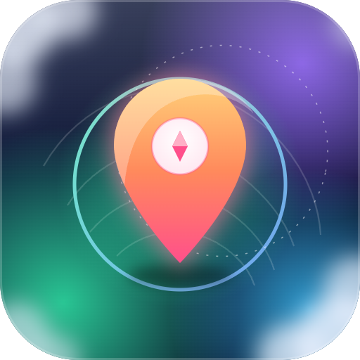

# 🧭 TravelOpenMap

**Кроссплатформенный (Android · iOS · веб) дневник путешествий с «туманом войны» на карте OpenStreetMap. Работает офлайн.**

*[English → README.en.md](README.en.md)*


Мир закрыт туманом — он рассеивается там, где вы побывали. Сохраняйте места с фото, видео и описанием, получайте уровни, проходите челленджи, тренируйтесь, планируйте поездки.

## ✨ Возможности

| | |
|---|---|
| 🌫️ **Туман войны** | Рассеивается по GPS, радиус 30–150 м, мягкие светящиеся границы. |
| 💨 **Ветер** | Облака тумана дрейфуют, есть порывы; скорость настраивается или выключается. |
| ✏️ **Правка тумана** | Кисть: проведите пальцем — туман под мазком открывается или закрывается сразу. Есть круг и произвольная область; размер кисти выбирается, два пальца двигают и масштабируют карту. Многошаговые отмена и возврат. Нужна для мест, где вы бывали до установки приложения. |
| 👁️ **Карта без тумана** | Один переключатель; поверх карты — пройденный маршрут. |
| 📍 **Метки в любом месте** | Долгое нажатие (или правая кнопка) на карте → меню: поставить метку, открыть/закрыть туман, измерять отсюда. Фото, видео, описание, 9 категорий. |
| 🔢 **Группы меток** | При отдалении близкие метки собираются в значок со счётчиком и кольцом категорий; нажатие приближает карту. Метки в одной точке открываются списком. |
| 📏 **Измерение расстояний** | Точки на карте и заметках, длина отрезков и суммы. Метры / мили. |
| 🧭 **Компас** | Датчики ориентации, стрелка на выбранную метку, карта по компасу. |
| 🏆 **Уровни и челленджи** | 60 уровней, 10 званий, 38 челленджей, 3 ежедневных задания, серии дней. |
| 📊 **Статистика** | Графики по дням, накопленная площадь, календарь активности, распределения по часам, дням недели и категориям; периоды 7/30/90 дней и всё время. |
| 🏃 **Тренировки** | Ходьба и бег без тумана: время, дистанция, темп, сплиты, набор высоты, калории, маршрут, площадь охвата (полоса, петля, оболочка), история, GPX. |
| ✈️ **Планировщик поездок** | Страна, города, даты или «идея», статусы, чек-лист вещей, бюджет по категориям, таймлайн, обратный отсчёт. |
| 🗺️ **Онлайн-карта** | Тайлы [OpenFreeMap](https://openfreemap.org) подгружаются сами по мере просмотра и кэшируются на устройстве. Включается только с вашего согласия (см. [«Офлайн и приватность»](#-офлайн-и-приватность)). |
| 🚇 **Слои карты** | «Метро», «Активный отдых» (тропы, велодорожки, вершины, кемпинги), «Высоты» (изолинии с подписями и тени рельефа). |
| 📥 **Карты для офлайна** | Сохранение страны или области с выбором детализации и оценкой размера; при приближении к незнакомой области приложение предлагает сохранить её. Свои `.pmtiles` импортируются файлом. |
| 🛰️ **Запись в фоне** | Android: служба с уведомлением пишет маршрут при свёрнутом приложении и без сервисов Google Play; при возвращении след дорисовывается по порядку. |
| 🎓 **Обучение** | После знакомства предлагается короткий тур по интерфейсу; можно отказаться и пройти позже в настройках. |
| 🛡️ **Исключённые зоны** | Внутри круга (дом, работа) туман не открывается, шаги и маршрут не пишутся. |
| 💾 **Данные у вас** | IndexedDB на устройстве, резервная копия одним файлом, экспорт GPX и GeoJSON. |
| 👤 **Знакомство и профиль** | При первом запуске — ник (обязателен), аватар, страна, вес, язык, тема, единицы. Всё меняется в настройках. |
| 🌗 **Тема** | Системная (следует за телефоном), светлая или тёмная — карточки с превью в настройках. Русский и английский, метры / мили. |
| 📵 **Без Google Play** | Не использует сервисы Google; геолокация переключается на системный GPS. |

## 📸 Скриншоты

<table>
<tr>
<td><br><sub>Группы меток со счётчиком</sub></td>
<td><br><sub>Долгое нажатие: меню точки</sub></td>
<td><br><sub>Кисть тумана</sub></td>
<td><br><sub>Правка тумана: область</sub></td>
</tr>
<tr>
<td><br><sub>Туман, заметки, игрок</sub></td>
<td><br><sub>Ветер: три кадра с интервалом 3 с</sub></td>
<td><br><sub>Карта без тумана</sub></td>
<td><br><sub>Заметка с фото и компасом</sub></td>
</tr>
<tr>
<td><br><sub>Статистика</sub></td>
<td><br><sub>Тренировка</sub></td>
<td><br><sub>Итог тренировки</sub></td>
<td><br><sub>План поездки</sub></td>
</tr>
<tr>
<td><br><sub>Карта страны</sub></td>
<td><br><sub>Уровень и задания</sub></td>
<td><br><sub>Измерение</sub></td>
<td><br><sub>0 внешних запросов</sub></td>
</tr>
<tr>
<td><br><sub>Онлайн-карта со слоями</sub></td>
<td><br><sub>Слои карты</sub></td>
<td><br><sub>Предложение обучения</sub></td>
<td><br><sub>Подсказка обучения</sub></td>
</tr>
<tr>
<td><br><sub>Согласие на онлайн-карту</sub></td>
<td><br><sub>Сохранить область</sub></td>
<td><br><sub>Сохранённые области и кэш</sub></td>
<td><br><sub>Значок приложения</sub></td>
</tr>
</table>

Обзоры: [0.2](docs/screenshots/overview-ru-2.png) · [0.3](docs/screenshots/overview-ru-3.png) · [0.4](docs/screenshots/overview-ru-4.png) · [0.5](docs/screenshots/overview-ru-5.png) · [0.6](docs/screenshots/overview-ru-6.png) · [0.6, онлайн-режим](docs/screenshots/overview-ru-6b.png). Светлая тема и English UI — в [`docs/screenshots`](docs/screenshots).

## 🗺️ Карты

* **Онлайн-карта.** Векторные тайлы OpenStreetMap от [OpenFreeMap](https://openfreemap.org) (схема OpenMapTiles); MapLibre запрашивает их по мере просмотра, каждый тайл сохраняется в кэше на устройстве (до 500 МБ, настраивается).
* **Слои.** «Метро», «Активный отдых» и «Высоты» включаются кнопкой слоёв на карте. Рельеф — [AWS Terrain Tiles](https://registry.opendata.aws/terrain-tiles/), изолинии и тени строятся на устройстве.
* **Для офлайна.** *Профиль → Офлайн-карты → Выбрать страну* → детализация → «Сохранить для офлайна»; тайлы области закрепляются в кэше. Без сети карта рисуется из кэша.
* **Встроенная и своя карта.** Карта Монако в формате [PMTiles](https://docs.protomaps.com/pmtiles/) лежит в приложении; свои `.pmtiles` импортируются файлом ([подробно](docs/OFFLINE_MAPS.md)).
* Источники и что из них берётся — [docs/MAP_SOURCES.md](docs/MAP_SOURCES.md).

## 🔒 Офлайн и приватность

* Пока вы не разрешили онлайн-карту, приложение не делает сетевых запросов: политика CSP разрешает `self`, `blob:`, `data:` и два адреса карты — `tiles.openfreemap.org` и `elevation-tiles-prod.s3.amazonaws.com`; шрифты, иконки и встроенная карта — локальные; аналитики нет.
* Онлайн-карта включается в окне согласия после знакомства или в *Профиль → Офлайн-карты*. На серверы уходят номера тайлов (примерное место просмотра) и обычные заголовки HTTP; заметки, маршрут и туман остаются на устройстве.
* Запись в фоне выключена, пока вы её не включили; данные трека не покидают устройство.
* Android: разрешение `INTERNET` добавляется по умолчанию. Сборка без него: `node scripts/configure-native.mjs --offline-only`.
* `npm run test:e2e` проверяет продакшн-сборку в Chromium: без согласия наружу не уходит ни один запрос, после согласия — только два адреса карты.

Экран *Профиль → Приватность* показывает счётчики обращений.

## 🎮 Уровни и XP

| Источник | XP |
|---|---|
| Открытая карта | 1 XP за 1500 м² |
| Пройденный путь (включая тренировки) | 1 XP за 50 м |
| Заметка / фото / видео | 25 / 5 / 10 |
| Челлендж / задание дня | 30 … 4000 / 45 … 90 |

Звания: Прохожий → Турист → Путник → Следопыт → Исследователь → Первопроходец → Картограф → Навигатор → Легенда карт → Хранитель мира.

## 🧱 Технологии

Capacitor 8 · React 19 · TypeScript · Vite · MapLibre GL 6 · OpenFreeMap (OpenMapTiles) · maplibre-contour · PMTiles · `@protomaps/basemaps` · supercluster · IndexedDB (`idb`) · Zustand · Vitest · Playwright. Архитектура — в [docs/ARCHITECTURE.md](docs/ARCHITECTURE.md).

```
src/
  core/      гео, туман, правка тумана, уровни, челленджи, тренировки, поездки, статистика
  state/     движок (GPS → туман → XP), тренировки, поездки, сохранение областей, обучение, настройки
  map/       MapLibre, онлайн-карта и кэш тайлов, слои, PMTiles, туман, группы меток
  services/  геолокация, фоновая запись, компас, вибро
  data/      IndexedDB, резервные копии, каталог стран
  ui/        экраны, шторки, графики
  i18n/      ru / en
tools/       osm2pmtiles.py, сборка каталога стран, ресурсы карты
scripts/     скриншоты, e2e-проверка, настройка нативных проектов
docs/        MAP_SOURCES.md, OFFLINE_MAPS.md, ARCHITECTURE.md, screenshots/
android/ ios/   (android: служба фоновой записи)
```

## 🚀 Быстрый старт

```bash
npm install
npm run dev          # http://localhost:5173 ; ?demo — демо-данные (маршрут по Монако)
npm test             # юнит-тесты
npm run test:e2e     # «0 внешних запросов», кисть тумана, обучение, онлайн-режим на подменённых серверах
npm run build        # dist/
npm run release:test # тестовый release: APK + AAB + веб-архив → release/
```

Сборка Android и iOS, подписание, импорт карт, решение проблем — в **[INSTALLATION.md](INSTALLATION.md)**.

## ⚠️ Ограничения

* Release-сборка Android (APK/AAB) собирается в GitHub Actions ([`release-test.yml`](.github/workflows/release-test.yml)) и публикуется пре-релизом; подписана публичным тестовым ключом — только для проверки. Сборка на CI, включая службу фоновой записи, проходит; установка APK на устройство не проверялась.
* Проверено в Chromium (юнит-тесты, e2e, скриншоты). Нативные сборки на устройствах, реальные GPS и компас, камера телефона, работа фоновой службы на реальном телефоне и iOS WKWebView не проверялись.
* Онлайн-режим проверен на подменённых серверах (крошечный набор тайлов OpenMapTiles и настоящие тайлы рельефа, если доступны). Настоящий OpenFreeMap из среды разработки недоступен: формат ответов, CORS, лимиты и полнота данных слоёв не проверялись.
* Запись в фоне — только Android; на iOS и в вебе туман и тренировки пишутся, пока приложение на экране.
* Область для офлайна — до 80 000 тайлов, масштаб до 14 (рельеф до 12); размер загрузки — оценка.
* Шрифты карты: латиница, кириллица, греческий.

## 📄 Лицензии

Код — MIT. Данные карт © участники OpenStreetMap, [ODbL](https://www.openstreetmap.org/copyright); тайлы — [OpenFreeMap](https://openfreemap.org) и © [OpenMapTiles](https://openmaptiles.org); рельеф — [Terrain Tiles](https://github.com/tilezen/joerd/blob/master/docs/attribution.md). Шрифты Noto Sans — SIL OFL 1.1, спрайты — [protomaps/basemaps-assets](https://github.com/protomaps/basemaps-assets). Демо-карта Монако — из тестовых данных Project-OSRM.
