# 🧭 TravelOpenMap

**Кроссплатформенный (Android · iOS · веб) дневник путешествий с «туманом войны» на карте OpenStreetMap. Работает офлайн.**

*[English → README.en.md](README.en.md)*

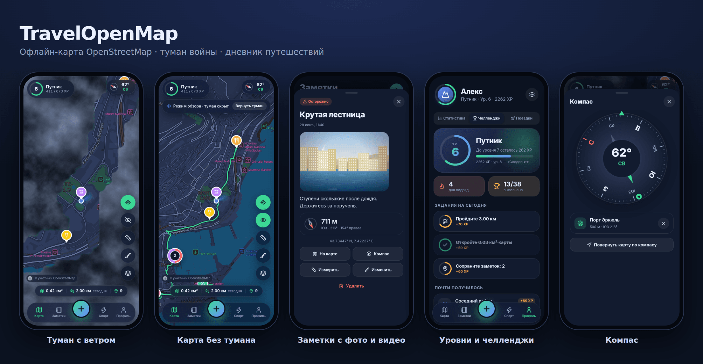

Мир закрыт туманом — он рассеивается там, где вы побывали. Сохраняйте места с фото, видео и описанием, получайте уровни, проходите челленджи, тренируйтесь, планируйте поездки.

## ✨ Возможности

| | |
|---|---|
| 🌫️ **Туман войны** | Рассеивается по GPS, радиус 30–150 м, мягкие светящиеся границы. |
| 💨 **Ветер** | Облака тумана дрейфуют, есть порывы; скорость настраивается или выключается. |
| ✏️ **Правка тумана** | Открыть или закрыть выбранный круг либо произвольную область вручную — для мест, где вы бывали до установки приложения. Отмена последней правки. |
| 👁️ **Карта без тумана** | Один переключатель; поверх карты — пройденный маршрут. |
| 📍 **Метки в любом месте** | Долгое нажатие (или правая кнопка) на карте → меню: поставить метку, открыть/закрыть туман, измерять отсюда. Фото, видео, описание, 9 категорий. |
| 🔢 **Группы меток** | При отдалении близкие метки собираются в значок со счётчиком и кольцом категорий; нажатие приближает карту. Метки в одной точке открываются списком. |
| 📏 **Измерение расстояний** | Точки на карте и заметках, длина отрезков и суммы. Метры / мили. |
| 🧭 **Компас** | Датчики ориентации, стрелка на выбранную метку, карта по компасу. |
| 🏆 **Уровни и челленджи** | 60 уровней, 10 званий, 38 челленджей, 3 ежедневных задания, серии дней. |
| 📊 **Статистика** | Графики по дням, накопленная площадь, календарь активности, распределения по часам, дням недели и категориям; периоды 7/30/90 дней и всё время. |
| 🏃 **Тренировки** | Ходьба и бег без тумана: время, дистанция, темп, сплиты, набор высоты, калории, маршрут, площадь охвата (полоса, петля, оболочка), история, GPX. |
| ✈️ **Планировщик поездок** | Страна, города, даты или «идея», статусы, чек-лист вещей, бюджет по категориям, таймлайн, обратный отсчёт. |
| 🌍 **Карты по странам и областям** | После знакомства предлагается обзорная карта мира; при приближении к области без подробной карты — карта этой области. Каталог стран, четыре уровня детализации, оценка размера. Загрузка — только с вашего согласия (см. [«Офлайн и приватность»](#-офлайн-и-приватность)); свои `.pmtiles` импортируются файлом. Все установленные карты рисуются вместе. |
| 🛡️ **Исключённые зоны** | Внутри круга (дом, работа) туман не открывается, шаги и маршрут не пишутся. |
| 💾 **Данные у вас** | IndexedDB на устройстве, резервная копия одним файлом, экспорт GPX и GeoJSON. |
| 👤 **Знакомство и профиль** | При первом запуске — ник (обязателен), аватар, страна, вес, язык, тема, единицы. Всё меняется в настройках. |
| 🌗 **Тема** | Системная (следует за телефоном), светлая или тёмная — карточки с превью в настройках. Русский и английский, метры / мили. |
| 📵 **Без Google Play** | Не использует сервисы Google; геолокация переключается на системный GPS. |

## 📸 Скриншоты

<table>
<tr>
<td>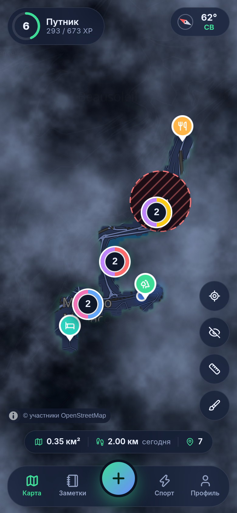<br><sub>Группы меток со счётчиком</sub></td>
<td>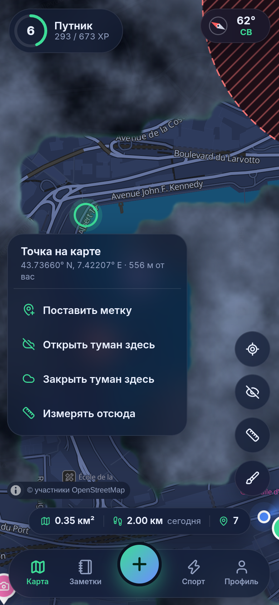<br><sub>Долгое нажатие: меню точки</sub></td>
<td>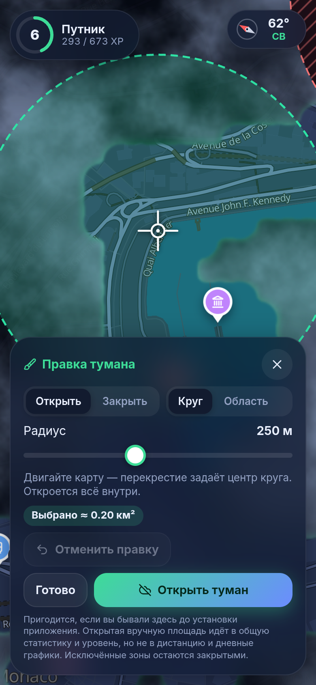<br><sub>Правка тумана: круг</sub></td>
<td>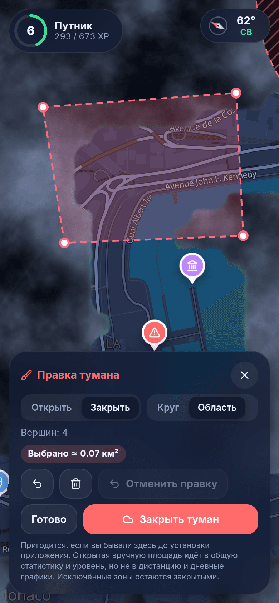<br><sub>Правка тумана: область</sub></td>
</tr>
<tr>
<td>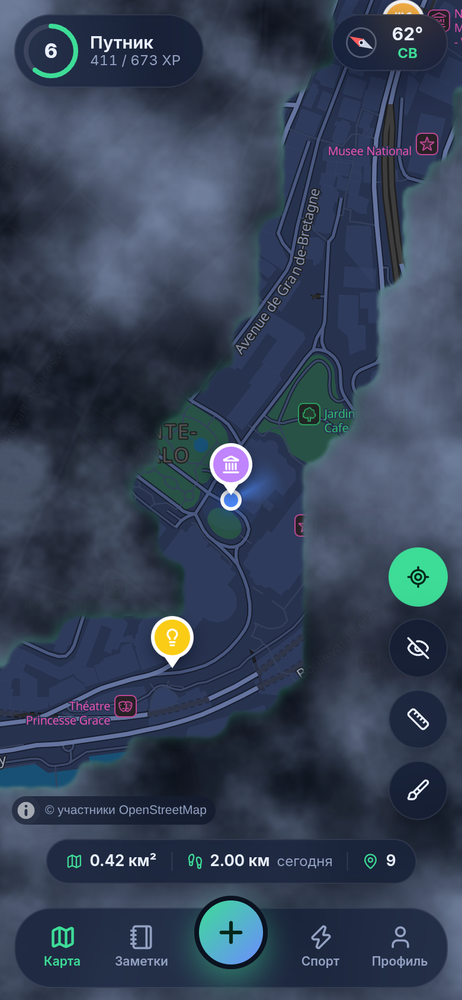<br><sub>Туман, заметки, игрок</sub></td>
<td>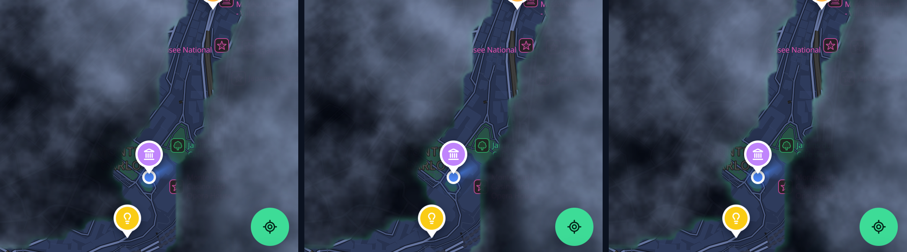<br><sub>Ветер: три кадра с интервалом 3 с</sub></td>
<td>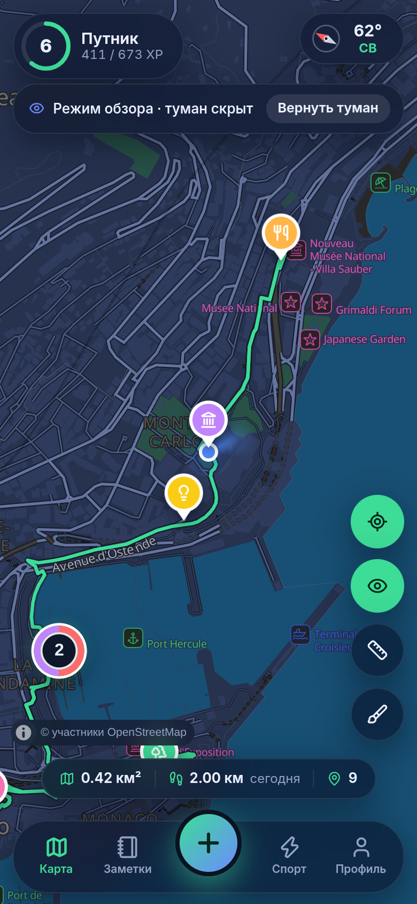<br><sub>Карта без тумана</sub></td>
<td>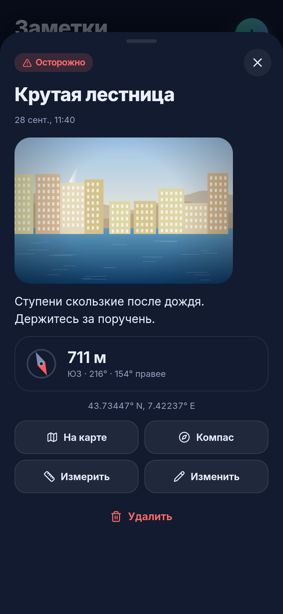<br><sub>Заметка с фото и компасом</sub></td>
</tr>
<tr>
<td>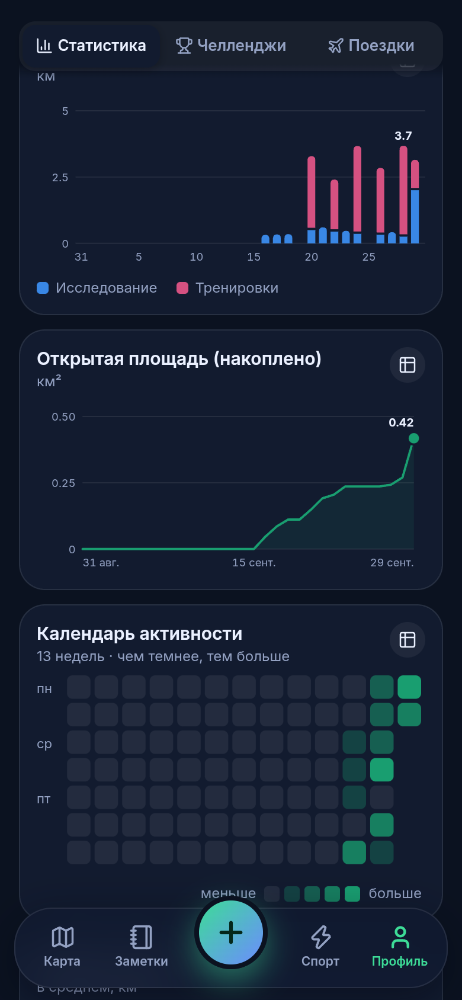<br><sub>Статистика</sub></td>
<td>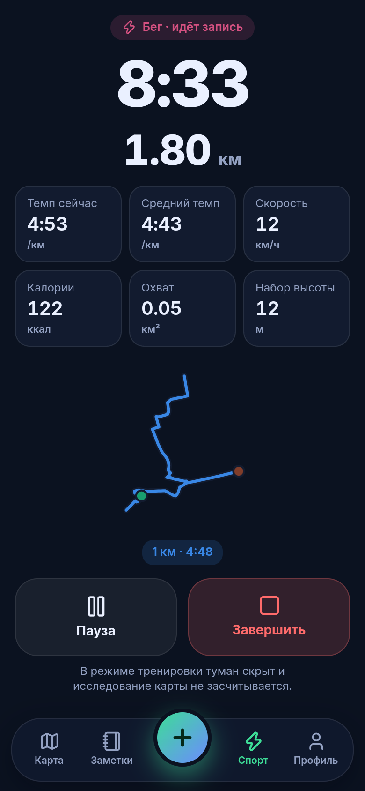<br><sub>Тренировка</sub></td>
<td>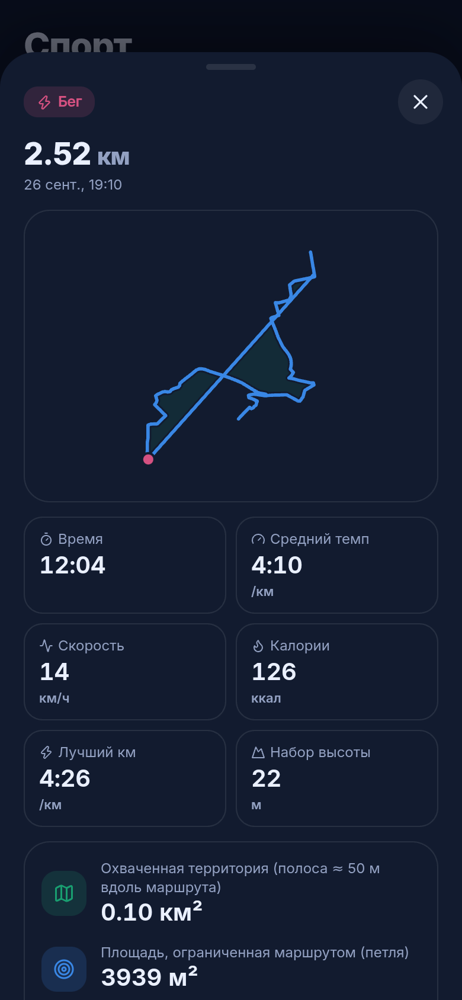<br><sub>Итог тренировки</sub></td>
<td>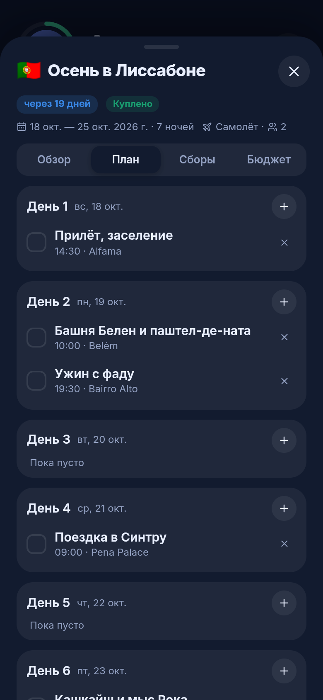<br><sub>План поездки</sub></td>
</tr>
<tr>
<td>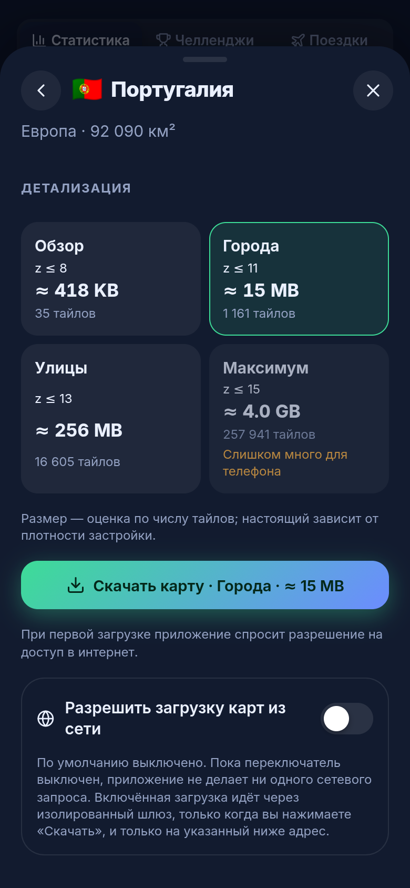<br><sub>Карта страны</sub></td>
<td>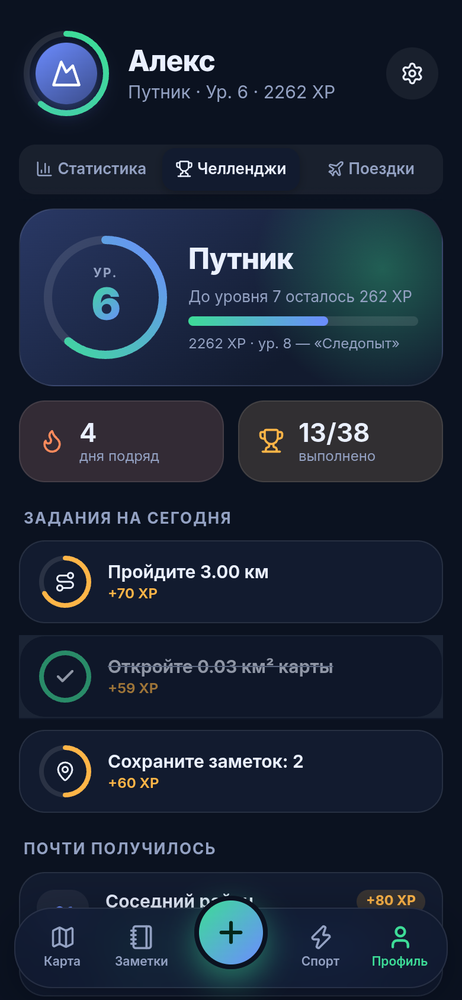<br><sub>Уровень и задания</sub></td>
<td>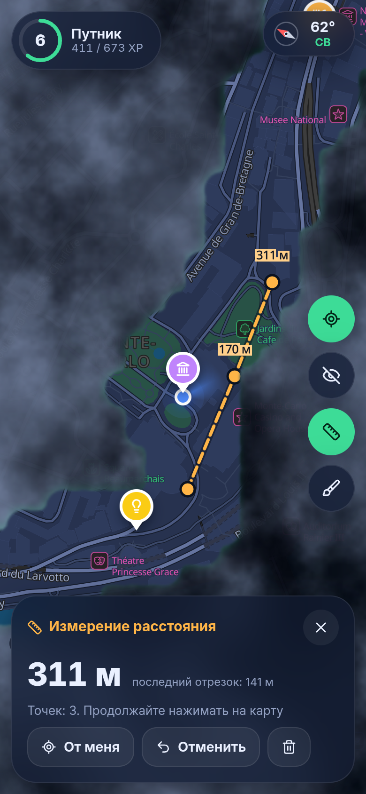<br><sub>Измерение</sub></td>
<td>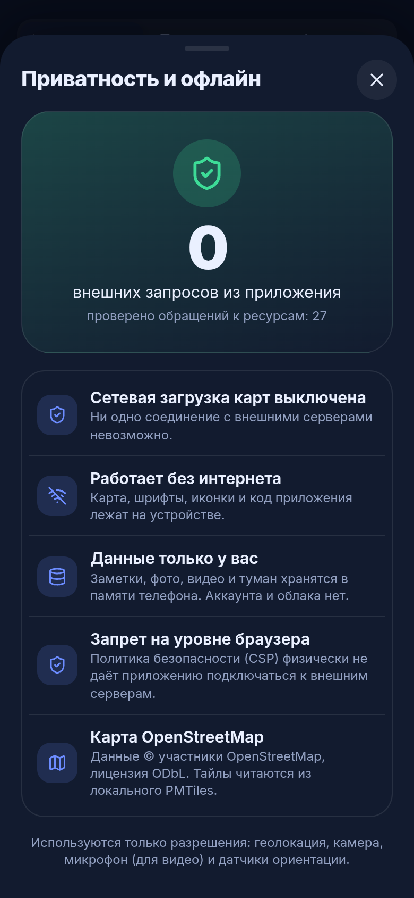<br><sub>0 внешних запросов</sub></td>
</tr>
</table>

Обзоры: [0.2](docs/screenshots/overview-ru-2.png) · [0.3](docs/screenshots/overview-ru-3.png) · [0.4](docs/screenshots/overview-ru-4.png) · [0.5](docs/screenshots/overview-ru-5.png). Светлая тема и English UI — в [`docs/screenshots`](docs/screenshots).

## 🗺️ Офлайн-карты

Карта — векторные тайлы OpenStreetMap в файле [PMTiles](https://docs.protomaps.com/pmtiles/) (схема [Protomaps Basemaps](https://docs.protomaps.com/basemaps/layers)); MapLibre читает его прямо с устройства. В приложение встроена карта Монако; остальное — по регионам.

Способы добавить карту ([подробно](docs/OFFLINE_MAPS.md)):

1. **В приложении:** *Профиль → Офлайн-карты → Добавить страну* (загрузка) или *Импортировать .pmtiles* (файл).
2. **`pmtiles extract`** — вырезать область из сборки Protomaps.
3. **[`tools/osm2pmtiles.py`](tools/osm2pmtiles.py)** — локальная конвертация `.osm.pbf` → `.pmtiles` (проверено на Монако, Андорре, Утрехте).
4. **Planetiler** — страны и континенты.

## 🔒 Офлайн и приватность

* Основное приложение не делает сетевых запросов: политика CSP разрешает только `self`, `blob:`, `data:`; шрифты, иконки и карта — локальные; аналитики и CDN нет.
* Загрузка карт выключена, пока вы не разрешите её в окне согласия (обзор мира после знакомства, кнопка «Скачать карту» или карточка при приближении). Источник — ежедневная сборка Protomaps или свой адрес; загрузка идёт изолированным шлюзом ([`gateway.html`](gateway.html)) только во время скачивания.
* Android: разрешение `INTERNET` добавляется по умолчанию. Сборка без него: `node scripts/configure-native.mjs --offline-only`.
* `npm run test:e2e` запускает продакшн-сборку в Chromium без DNS для внешних хостов и проверяет, что наружу не уходит ни один запрос.

Экран *Профиль → Приватность* показывает счётчики обращений.

## 🎮 Уровни и XP

| Источник | XP |
|---|---|
| Открытая карта | 1 XP за 1500 м² |
| Пройденный путь (включая тренировки) | 1 XP за 50 м |
| Заметка / фото / видео | 25 / 5 / 10 |
| Челлендж / задание дня | 30 … 4000 / 45 … 90 |

Звания: Прохожий → Турист → Путник → Следопыт → Исследователь → Первопроходец → Картограф → Навигатор → Легенда карт → Хранитель мира.

## 🧱 Технологии

Capacitor 8 · React 19 · TypeScript · Vite · MapLibre GL 6 · PMTiles · `@protomaps/basemaps` · supercluster · IndexedDB (`idb`) · Zustand · Vitest · Playwright. Архитектура — в [docs/ARCHITECTURE.md](docs/ARCHITECTURE.md).

```
src/
  core/      гео, туман, правка тумана, уровни, челленджи, тренировки, поездки, статистика
  state/     движок (GPS → туман → XP), тренировки, поездки, загрузки, настройки
  map/       MapLibre, PMTiles, туман, группы меток, экстрактор и шлюз загрузки
  gateway/   изолированный сетевой шлюз
  data/      IndexedDB, резервные копии, каталог стран
  ui/        экраны, шторки, графики
  i18n/      ru / en
tools/       osm2pmtiles.py, сборка каталога стран, ресурсы карты
scripts/     скриншоты, e2e-проверка, настройка нативных проектов
docs/        OFFLINE_MAPS.md, ARCHITECTURE.md, screenshots/
android/ ios/
```

## 🚀 Быстрый старт

```bash
npm install
npm run dev          # http://localhost:5173 ; ?demo — демо-данные (маршрут по Монако)
npm test             # 109 юнит-тестов
npm run test:e2e     # проверка «0 внешних запросов»
npm run build        # dist/
npm run release:test # тестовый release: APK + AAB + веб-архив → release/
```

Сборка Android и iOS, подписание, импорт карт, решение проблем — в **[INSTALLATION.md](INSTALLATION.md)**.

## ⚠️ Ограничения

* Release-сборка Android (APK/AAB) собирается в GitHub Actions ([`release-test.yml`](.github/workflows/release-test.yml)) и публикуется пре-релизом ([v0.4.0-test.3](https://github.com/externaluser536-svg/TravelOpenMap/releases/tag/v0.4.0-test.3)); подписана публичным тестовым ключом — только для проверки. Сборка на CI прошла успешно; установка APK на устройство не проверялась.
* Проверено в Chromium (юнит-тесты, e2e, скриншоты). Нативные сборки Android/iOS, реальные датчики GPS и компаса, камера телефона, поведение iOS WKWebView на устройствах не проверялись.
* Загрузка карт проверена на локальном PMTiles-сервере; реальный сервер Protomaps (в том числе автоподбор последней ежедневной сборки) не проверялся. Источник должен поддерживать HTTP Range и CORS.
* Туман и тренировки записываются, пока приложение на экране; фонового GPS нет.
* Размер загрузки — оценка; лимит одной загрузки 300 МБ.
* Один активный файл карты за раз.
* Шрифты карты: латиница, кириллица, греческий.

## 📄 Лицензии

Код — MIT. Данные карт © участники OpenStreetMap, [ODbL](https://www.openstreetmap.org/copyright). Шрифты Noto Sans — SIL OFL 1.1, спрайты — [protomaps/basemaps-assets](https://github.com/protomaps/basemaps-assets). Демо-карта Монако — из тестовых данных Project-OSRM.
